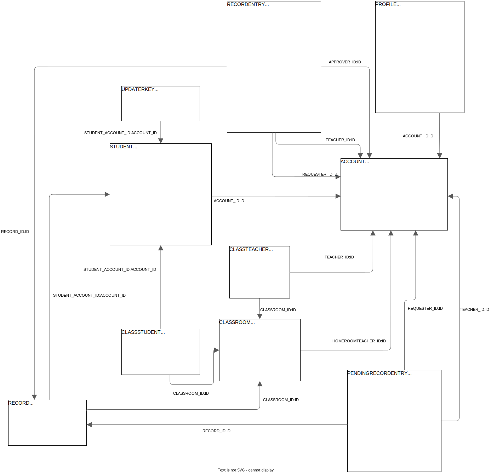

# Software Design Description

## Overall Description

### Assumptions


### Design Constraints


### Technology Suggestion


## System Architecture Design

### Overall Architecture

```{#fig-overall .plantuml caption="Overall architecture"}
@startuml

left to right direction

component "Chain Node 1" as CN1 #Aqua
component "Request Server 1" as RS1 #Lime
component "Frontend Server 1" as FS1
RS1 - CN1
FS1 - RS1

component "Chain Node 2" as CN2 #Aqua
component "Request Server 2" as RS2 #Lime
component "Frontend Server 2" as FS2
RS2 - CN2
FS2 - RS2

component "Chain Node 3" as CN3 #Aqua
component "Request Server 3" as RS3 #Lime
component "Frontend Server 3" as FS3
RS3 - CN3
FS3 - RS3

component ".." as E1 #Aqua
component ".." as E2 #Aqua

CN1 -- CN2
CN2 -- CN3

E1 -- CN1
CN3 -- E2

@enduml
```

| Component       | Description                                                                                                                                                                                                                        |
| --------------- | ---------------------------------------------------------------------------------------------------------------------------------------------------------------------------------------------------------------------------------- |
| Chain Node (CN) | A node of the blockchain. This stores the records and handles the history and transaction requests from the Request Server (Change/View the score, information, etc.)                                                              |
| Request Server  | The off-chain backend of a CN. This stores the pending requests from the user and is the only way to call a request to the CN. Each Request Server may have a different way to handle user requests (Voting, Direct Request, etc.) |
| Frontend Server | Provide the UX/UI for interacting with the Request Server                                                                                                                                                                          |

### System Architecture


### Package Diagram

```{#fig-package .plantuml caption="Package Diagram of Request Server"}
@startuml
skinparam linetype ortho

package root {
    node RequestServer as RS
    node DatabaseManager as Database

    package api {
        entity ServerHandler as SH
        entity StudentUpdater as SU
    }
    package entity {
        entity Account
        entity Student
        entity Classroom
        entity Record
        entity RecordEntry
        entity "..." as blank1
    }
    package handler {
        node AccountHandler
        node ClassroomHandler
        node RecordHandler
        node FabricHandler
        node StudentUpdateHandler
        node "..." as blank2
    }
    package internal {
        package student
        package "..."
    }
    package model {
        package input
        package output
        package fabric
    }
}
StudentUpdateHandler --> FabricHandler : access
student -d-> SU : import
Database -u-> entity : import
handler -d-> internal : access
handler --> model : import
handler -u-> entity : access
student -u-> fabric : access
RS --> handler : import
handler -u-> SH : import
@enduml
```

| Package Name     | Description                                          |
| ---------------- | ---------------------------------------------------- |
| root             | Main classes                                         |
| api              | The abstract classes & interfaces                    |
| entity           | The entities of the database                         |
| handler          | The handlers of the endpoints of the REST API server |
| internal         | Internal classes used by other packages              |
| internal/student | The instances of the Student Updater                 |
| model            | The input / output objects                           |
| model/input      | The input objects for the handlers                   |
| model/output     | The output objects returned from the handlers        |
| model/fabric     | The models used internally by the student updater    |

## System Detailed Design

### Class Diagram

{#fig-class}

### Sequence Diagram

## Class Specification


## Data & Database Design

### Database Design

{#fig-db-design}

#### Account

| Field Name     | Type              | Size | Unique | Not Null | Flag | Notes |
| -------------- | ----------------- | ---- | ------ | -------- | ---- | ----- |
| ID             | bigint            |      | x      | x        | PK   |       |
| USERNAME       | character varying | 255  | x      | x        |      |       |
| HASHEDPASSWORD | character varying | 255  |        | x        |      |       |
| SALT           | character varying | 255  |        | x        |      |       |
| ROLE           | character varying | 255  |        | x        |      |       |
| CREATEDAT      | timestamp         |      |        | x        |      |       |

#### Profile

| Field Name  | Type              | Size | Unique | Not Null | Flag   | Notes                              |
| ----------- | ----------------- | ---- | ------ | -------- | ------ | ---------------------------------- |
| ACCOUNT\_ID | bigint            |      | x      | x        | PK, FK |                                    |
| ADDRESS     | character varying | 255  |        | x        |        |                                    |
| AVATAR      | character varying | 255  |        | x        |        |                                    |
| BIRTHDATE   | timestamp         |      |        | x        |        |                                    |
| EMAIL       | character varying | 255  |        | x        |        |                                    |
| FIRSTNAME   | character varying | 255  |        | x        |        |                                    |
| LASTNAME    | character varying | 255  |        | x        |        |                                    |
| MALE        | boolean           |      |        | x        |        |                                    |
| PHONE       | character varying | 255  |        | x        |        |                                    |
| UPDATED     | boolean           |      |        | x        |        | Used internally by student updater |

#### Student

| Field Name   | Type              | Size | Unique | Not Null | Flag   | Notes |
| ------------ | ----------------- | ---- | ------ | -------- | ------ | ----- |
| ACCOUNT\_ID  | bigint            |      | x      | x        | PK, FK |       |
| ETHNIC       | character varying | 255  |        | x        |        |       |
| FATHERJOB    | character varying | 255  |        | x        |        |       |
| FATHERNAME   | character varying | 255  |        | x        |        |       |
| GUARDIANJOB  | character varying | 255  |        | x        |        |       |
| GUARDIANNAME | character varying | 255  |        | x        |        |       |
| HOMETOWN     | character varying | 255  |        | x        |        |       |
| MOTHERJOB    | character varying | 255  |        | x        |        |       |
| MOTHERNAME   | character varying | 255  |        | x        |        |       |

#### Classroom

| Field Name          | Type              | Size | Unique | Not Null | Flag | Notes |
| ------------------- | ----------------- | ---- | ------ | -------- | ---- | ----- |
| ID                  | bigint            |      | x      | x        | PK   |       |
| NAME                | character varying | 255  |        | x        |      |       |
| GRADE               | character varying | 255  |        | x        |      |       |
| HOMEROOMTEACHER\_ID | bigint            |      |        | x        | FK   |       |
| START_YEAR          | integer           |      |        | x        |      |       |

#### Class Student

| Field Name    | Type   | Size | Unique | Not Null | Flag | Notes |
| ------------- | ------ | ---- | ------ | -------- | ---- | ----- |
| ID            | bigint |      | x      | x        | PK   |       |
| CLASSROOM\_ID | bigint |      |        | x        | FK   |       |
| STUDENT\_ID   | bigint |      |        | x        | FK   |       |

#### Class Teacher

| Field Name    | Type   | Size | Unique | Not Null | Flag | Notes                          |
| ------------- | ------ | ---- | ------ | -------- | ---- | ------------------------------ |
| ID            | bigint |      | x      | x        | PK   |                                |
| CLASSROOM\_ID | bigint |      |        | x        | FK   |                                |
| TEACHER\_ID   | bigint |      |        | x        | FK   |                                |
| SUBJECTID     | bigint |      |        | x        |      | Defined in the system's config |

#### Record

| Field Name           | Type   | Size | Unique | Not Null | Flag | Notes |
| -------------------- | ------ | ---- | ------ | -------- | ---- | ----- |
| ID                   | bigint |      | x      | x        | PK   |       |
| CLASSROOM\_ID        | bigint |      |        | x        | FK   |       |
| STUDENT\_ACCOUNT\_ID | bigint |      |        | x        | FK   |       |

#### Record Entry

| Field Name      | Type             | Size | Unique | Not Null | Flag | Notes                              |
| --------------- | ---------------- | ---- | ------ | -------- | ---- | ---------------------------------- |
| ID              | bigint           |      | x      | x        | PK   |                                    |
| RECORD\_ID      | bigint           |      |        | x        | FK   |                                    |
| REQUESTER\_ID   | bigint           |      |        |          | FK   |                                    |
| TEACHER\_ID     | bigint           |      |        |          | FK   |                                    |
| APPROVER\_ID    | bigint           |      |        |          | FK   |                                    |
| APPROVALDATE    | timestamp        |      |        | x        |      |                                    |
| REQUESTDATE     | timestamp        |      |        | x        |      |                                    |
| FIRSTHALFSCORE  | double precision |      |        | x        |      |                                    |
| SECONDHALFSCORE | double precision |      |        | x        |      |                                    |
| FINALSCORE      | double precision |      |        | x        |      |                                    |
| SUBJECTID       | bigint           |      |        | x        |      | Defined in the system's config     |
| UPDATECOMPLETE  | boolean          |      |        | x        |      | Used internally by student updater |

#### Pending Record Entry

| Field Name      | Type             | Size | Unique | Not Null | Flag | Notes                          |
| --------------- | ---------------- | ---- | ------ | -------- | ---- | ------------------------------ |
| ID              | bigint           |      | x      | x        | PK   |                                |
| RECORD\_ID      | bigint           |      |        | x        | FK   |                                |
| REQUESTER\_ID   | bigint           |      |        | x        | FK   |                                |
| TEACHER\_ID     | bigint           |      |        | x        | FK   |                                |
| REQUESTDATE     | timestamp        |      |        | x        |      |                                |
| FIRSTHALFSCORE  | double precision |      |        | x        |      |                                |
| SECONDHALFSCORE | double precision |      |        | x        |      |                                |
| FINALSCORE      | double precision |      |        | x        |      |                                |
| SUBJECTID       | bigint           |      |        | x        |      | Defined in the system's config |

### Updater Key

| Field Name           | Type              | Size | Unique | Not Null | Flag | Notes |
| -------------------- | ----------------- | ---- | ------ | -------- | ---- | ----- |
| ID                   | character varying | 255  | x      | x        | PK   |       |
| STUDENT\_ACCOUNT\_ID | bigint            |      |        | x        | FK   |       |

### Data File Design

| File Name | Type   | Notes                                                |
| --------- | ------ | ---------------------------------------------------- |
| db        | Folder | The folder of The H2 Database files                  |
| updater   | Folder | Contains the data files of the local student updater |