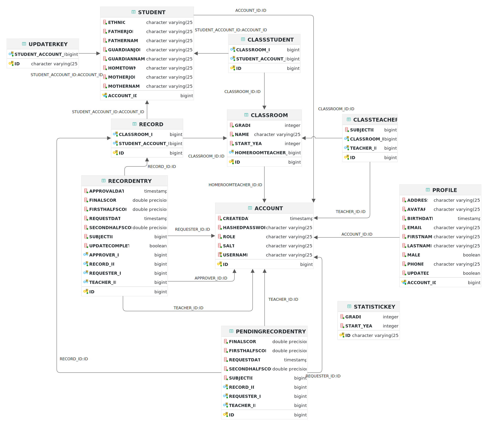

# Software Design Description

## Overall Description

### Assumptions

- The target platform is a Docker-compatible operating system (Preferably Linux).
- The target web browser is Google Chrome.
- All products are run and operated in the same machine (Monolithic architecture).
- Only administrators can access the running system. Other users can only access the system through the frontend server.
- The blockchain is a private blockchain.
- The blockchain is an optional feature that can be turned on or off.
- The database is a H2 database.
- The mode of the database can be in-memory (for testing), file or remote (for production).

### Design Constraints

- The backend system is a REST API server.
- The backend system is a Java application.
- The blockchain is a Hyperledger Fabric blockchain.
- There should be an option to turn on or off the blockchain. If the blockchain is turned off, the backend system should still work as a normal REST API server with a local database.

### Technology Suggestion

- The endpoints of the backend system can be exposed so that a node browser can be developed to search & access the endpoints and get the necessary information.

## System Architecture Design

### Overall Architecture

{#fig-overall}

### System Architecture

{#fig-system}

### Package Diagram

```{#fig-package .plantuml caption="Package Diagram of Request Server"}
@startuml
skinparam linetype ortho

package root {
    node RequestServer as RS
    node DatabaseManager as Database

    package api {
        entity ServerHandler as SH
        entity StudentUpdater as SU
    }
    package entity {
        entity Account
        entity Student
        entity Classroom
        entity Record
        entity RecordEntry
        entity "..." as blank1
    }
    package handler {
        node AccountHandler
        node ClassroomHandler
        node RecordHandler
        node FabricHandler
        node StudentUpdateHandler
        node "..." as blank2
    }
    package internal {
        package student
        package "..."
    }
    package model {
        package input
        package output
        package fabric
    }
}
StudentUpdateHandler --> FabricHandler : access
student -d-> SU : import
Database -u-> entity : import
handler -d-> internal : access
handler --> model : import
handler -u-> entity : access
student -u-> fabric : access
RS --> handler : import
handler -u-> SH : import
@enduml
```

| Package Name     | Description                                          |
| ---------------- | ---------------------------------------------------- |
| root             | Main classes                                         |
| api              | The abstract classes & interfaces                    |
| entity           | The entities of the database                         |
| handler          | The handlers of the endpoints of the REST API server |
| internal         | Internal classes used by other packages              |
| internal/student | The instances of the Student Updater                 |
| model            | The input / output objects                           |
| model/input      | The input objects for the handlers                   |
| model/output     | The output objects returned from the handlers        |
| model/fabric     | The models used internally by the student updater    |

: Package Detail of the Request Server {#tbl-package}

## System Detailed Design

### Class Specification

{#fig-class}

#### Account

| Field Name                    | Type                    | Description                                                                                                    |
| ----------------------------- | ----------------------- | -------------------------------------------------------------------------------------------------------------- |
| id                            | long                    | The account id                                                                                                 |
| username                      | String                  | The username                                                                                                   |
| hashedPassword                | String                  | The hashed password                                                                                            |
| salt                          | String                  | The salt of the password                                                                                       |
| role                          | String                  | The role of the account                                                                                        |
| createdAt                     | Date                    | The date when the account was created                                                                          |
| classrooms                    | List ClassTeacher       | The list of references to the classrooms that the account participates if its role is Teacher                  |
| recordEntries                 | List RecordEntry        | The list of record entries related to the subjects that the account is teaching if its role is Teacher         |
| requestedRecordEntries        | List RecordEntry        | The list of verified record entries that the account requested to changes                                      |
| approvedRecordEntries         | List RecordEntry        | The list of verified record entries that the account accepted                                                  |
| pendingRecordEntries          | List PendingRecordEntry | The list of pending record entries related to the subjects that the account is teaching if its role is Teacher |
| requestedPendingRecordEntries | List PendingRecordEntry | The list of pending record entries that the account requested to changes                                       |
| homeClassrooms                | List Classroom          | The list of classrooms the the account is a homeroom teacher at                                                |

: Fields of Account {#tbl-class-account}

#### Profile

| Field Name | Type    | Description                                                                      |
| ---------- | ------- | -------------------------------------------------------------------------------- |
| id         | long    | The account id                                                                   |
| account    | Account | The reference to the Account object                                              |
| firstName  | String  | The first name                                                                   |
| lastName   | String  | The last name                                                                    |
| male       | boolean | Is the person male? false if she is a female                                     |
| avatar     | String  | The link to the avatar image                                                     |
| birthDate  | Date    | The date of the birthday                                                         |
| address    | String  | The address                                                                      |
| phone      | String  | The phone number                                                                 |
| email      | String  | The email                                                                        |
| updated    | boolean | The flag indicates that the profile requires synchronization with the Chain Node |

: Fields of Profile {#tbl-class-profile}

#### Student

| Field Name   | Type              | Description                                                                                         |
| ------------ | ----------------- | --------------------------------------------------------------------------------------------------- |
| id           | long              | The account id                                                                                      |
| account      | Account           | The reference to the Account object                                                                 |
| ethnic       | String            | The ethnic of the student                                                                           |
| fatherName   | String            | The name of the father of the student                                                               |
| fatherJob    | String            | The job of the father of the student                                                                |
| motherName   | String            | The name of the mother of the student                                                               |
| motherJob    | String            | The job of the mother of the student                                                                |
| guardianName | String            | The name of the guardian of the student                                                             |
| guardianJob  | String            | The job of the guardian of the student                                                              |
| homeTown     | String            | The home town of the student                                                                        |
| classrooms   | List ClassStudent | The list of references to the classrooms that the student participates                              |
| records      | List Record       | The list of records related to the classrooms that the student participates                         |
| updaterKey   | List UpdaterKey   | The list of updater keys of the student. Used to allow outsiders to get information of the student. |

: Fields of Student {#tbl-class-student}

#### Classroom

| Field Name      | Type              | Description                                                              |
| --------------- | ----------------- | ------------------------------------------------------------------------ |
| id              | long              | The classroom id                                                         |
| name            | String            | The name of the classroom                                                |
| grade           | int               | The grade of the classroom                                               |
| year            | int               | The year of the classroom                                                |
| homeroomTeacher | Account           | The reference to the homeroom teacher of the classroom                   |
| students        | List ClassStudent | The list of references to the students that participate in the classroom |
| teachers        | List ClassTeacher | The list of references to the teachers that participate in the classroom |
| records         | List Record       | The list of records related to the classroom                             |

: Fields of Classroom {#tbl-class-classroom}

#### ClassStudent

| Field Name | Type      | Description                    |
| ---------- | --------- | ------------------------------ |
| id         | long      | The id of the reference        |
| classroom  | Classroom | The reference to the classroom |
| student    | Student   | The reference to the student   |

: Fields of ClassStudent {#tbl-class-classstudent}

#### ClassTeacher

| Field Name | Type      | Description                                    |
| ---------- | --------- | ---------------------------------------------- |
| id         | long      | The id of the reference                        |
| classroom  | Classroom | The reference to the classroom                 |
| teacher    | Account   | The reference to the teacher                   |
| subjectId  | long      | The id of the subject that the teacher teaches |

: Fields of ClassTeacher {#tbl-class-classteacher}

#### Record

| Field Name         | Type                    | Description                                               |
| ------------------ | ----------------------- | --------------------------------------------------------- |
| id                 | long                    | The record id                                             |
| classroom          | Classroom               | The reference to the classroom                            |
| student            | Student                 | The reference to the student                              |
| recordEntry        | List RecordEntry        | The list of verified record entries related to the record |
| pendingRecordEntry | List PendingRecordEntry | The list of pending record entries related to the record  |

: Fields of Record {#tbl-class-record}

#### RecordEntry

| Field Name      | Type    | Description                                                            |
| --------------- | ------- | ---------------------------------------------------------------------- |
| id              | long    | The record entry id                                                    |
| subjectId       | long    | The id of the subject that the record entry is related to              |
| firstHalfScore  | int     | The score of the first semester of the subject                         |
| secondHalfScore | int     | The score of the second semester of the subject                        |
| finalScore      | int     | The final score of the subject                                         |
| requestDate     | Date    | The date when the record entry was requested                           |
| approvalDate    | Date    | The date when the record entry was approved                            |
| updateComplete  | boolean | The flag indicates that the record entry was updated to the Chain Node |
| teacher         | Account | The reference to the teacher that teaches the subject                  |
| requester       | Account | The reference to the account that requested the record entry           |
| approver        | Account | The reference to the account that approved the record entry            |
| record          | Record  | The reference to the record that the record entry is related to        |

: Fields of RecordEntry {#tbl-class-recordentry}

#### PendingRecordEntry

| Field Name      | Type    | Description                                                             |
| --------------- | ------- | ----------------------------------------------------------------------- |
| id              | long    | The pending record entry id                                             |
| subjectId       | long    | The id of the subject that the pending record entry is related to       |
| firstHalfScore  | int     | The score of the first semester of the subject                          |
| secondHalfScore | int     | The score of the second semester of the subject                         |
| finalScore      | int     | The final score of the subject                                          |
| requestDate     | Date    | The date when the pending record entry was requested                    |
| teacher         | Account | The reference to the teacher that teaches the subject                   |
| requester       | Account | The reference to the account that requested the pending record entry    |
| record          | Record  | The reference to the record that the pending record entry is related to |

: Fields of PendingRecordEntry {#tbl-class-pendingrecordentry}

#### UpdaterKey

| Field Name | Type    | Description                                             |
| ---------- | ------- | ------------------------------------------------------- |
| id         | String  | The unique key                                          |
| student    | Student | The reference to the student that the key is related to |

: Fields of UpdaterKey {#tbl-class-updaterkey}

#### StatisticKey

| Field Name | Type   | Description                           |
| ---------- | ------ | ------------------------------------- |
| id         | String | The unique key                        |
| year       | int    | The year that the key is referred to  |
| grade      | int    | The grade that the key is referred to |

: Fields of StatisticKey {#tbl-class-statistickey}

### Sequence Diagram

#### Create Account

```{#fig-sequence-create-account .plantuml caption="Sequence Diagram to Create Account"}
@startuml
autonumber

actor User as U
participant Frontend as F
participant "Request Server" as RS
participant "Account Handler" as RH
database Database as DB

loop Multiple accounts
  U -> F : Enter First Name
  U -> F : Enter Last Name
  U -> F : Enter Role
end
U -> F : Click Submit button
activate F
F -> RS : Send request
activate RS
RS -> RH : Forward request
activate RH
loop Multiple accounts
  RH -> RH : Generate unique account from request
  activate RH
  deactivate RH
  RH -> DB : Store account
  activate DB
  DB --> RH : Return success
end
deactivate DB
RH --> RS : Wrap created accounts to response
deactivate RH
RS --> F : Return response
deactivate RS
F --> U : Display created accounts
deactivate F
@enduml
```

#### Get Account

```{#fig-sequence-get-account .plantuml caption="Sequence Diagram to Get Account"}
@startuml
autonumber

actor User as U
participant Frontend as F
participant "Request Server" as RS
participant "Account Handler" as RH
database Database as DB

U -> F : Go to account page
activate F
F -> RS : Send request
activate RS
RS -> RH : Forward request
activate RH
RH -> DB : Get account
activate DB
alt Account exists
    DB --> RH : Return account
    deactivate DB
    RH --> RS : Wrap account to response
    deactivate RH
else Account does not exist
    activate DB
    DB --> RH : Return error
    deactivate DB
    activate RH
    RH --> RS : Wrap error to response
    deactivate RH
end
RS --> F : Return response
deactivate RS
F --> U : Show account / error
deactivate F
@enduml
```

#### Get Account List

```{#fig-sequence-get-account-list .plantuml caption="Sequence Diagram to Get Account List"}
@startuml
autonumber

actor User as U
participant Frontend as F
participant "Request Server" as RS
participant "Account Handler" as RH
database Database as DB

U -> F : Go to account list page
activate F
F -> RS : Send request
activate RS
RS -> RH : Forward request
activate RH
RH -> DB : Fetch Accounts
activate DB
DB --> RH : Return Accounts
deactivate DB

alt Request has filters
    RH -> RH : Filter Accounts
end
RH --> RS : Wrap accounts to response
deactivate RH
RS --> F : Return response
deactivate RS
F --> U : Display accounts
@enduml
```

#### Login

```{#fig-sequence-login .plantuml caption="Sequence Diagram to Login"}
@startuml
autonumber

actor User as U
participant Frontend as F
participant "Request Server" as RS
participant "Account Handler" as RH
database Database as DB

U -> F : Enter username
U -> F : Enter password
U -> F : Click Login button
activate F
F -> RS : Send request
activate RS
RS -> RH : Forward request
activate RH
RH -> DB : Get account by username
activate DB
alt Account does not exist
    DB --> RH : Return error
    deactivate DB
    RH --> RS : Wrap error to response
    deactivate RH
else Account exists
    activate DB
    DB --> RH : Return account
    deactivate DB
    activate RH
    RH -> RH : Verify password
    activate RH
    deactivate RH
    alt Password is correct
        RH -> RH : Generate account token
        activate RH
        deactivate RH
        RH --> RS : Wrap token to response
        deactivate RH
    else Password is incorrect
        RH --> RS : Wrap error to response
        activate RH
        deactivate RH
    end
    deactivate RH
end
RS --> F : Return response
deactivate RS
F --> U : Display response
deactivate F
@enduml
```

#### Update Account Password

```{#fig-sequence-update-account-password .plantuml caption="Sequence Diagram to Update Account Password"}
@startuml
autonumber

actor User as U
participant Frontend as F
participant "Request Server" as RS
participant "Account Handler" as RH
database Database as DB

U -> F : Go to account password page
U -> F : Enter username
U -> F : Enter new password
U -> F : Click Submit button
activate F
F -> RS : Send request
activate RS
RS -> RH : Forward request
activate RH
RH -> DB : Get account by username
activate DB
alt Account does not exist
    DB --> RH : Return error
    deactivate DB
    RH --> RS : Wrap error to response
    deactivate RH
else Account exists
    activate DB
    DB --> RH : Return account
    deactivate DB
    activate RH
    RH -> RH : Update new password
    activate RH
    deactivate RH
    RH -> DB : Update account
    activate DB
    DB --> RH : Return success
    deactivate DB
    RH --> RS : Wrap success to response
    deactivate RH
end
RS --> F : Send response
deactivate RS
F --> U : Display response
deactivate F
@enduml
```

#### Update Account Profile

```{#fig-sequence-update-account-profile .plantuml caption="Sequence Diagram to Update Account Profile"}
@startuml
autonumber

actor User as U
participant Frontend as F
participant "Request Server" as RS
participant "Account Handler" as RH
database Database as DB

U -> F : Go to account profile page
U -> F : Enter new profile information
U -> F : Click Submit button
activate F
F -> RS : Send request
activate RS
RS -> RH : Forward request
activate RH
RH -> DB : Get account
activate DB
alt Account does not exist
    DB --> RH : Return error
    deactivate DB
    RH --> RS : Wrap error to response
    deactivate RH
else Account exists
    activate DB
    DB --> RH : Return account
    deactivate DB
    activate RH
    RH -> RH : Update account profile
    activate RH
    deactivate RH
    RH -> DB : Update account
    activate DB
    DB --> RH : Return success
    deactivate DB
    RH --> RS : Wrap success to response
    deactivate RH
end
RS --> F : Return response
deactivate RS
F --> U : Display response
deactivate F
@enduml
```

#### Create Classroom

```{#fig-sequence-create-classroom .plantuml caption="Sequence Diagram to Create Classroom"}
@startuml
autonumber

actor User as U
participant Frontend as F
participant "Request Server" as RS
participant "Classroom Handler" as RH
database Database as DB

U -> F : Enter Classroom information
U -> F : Click Submit button
activate F
F -> RS : Send request
activate RS
RS -> RH : Forward request
activate RH
RH -> RH : Validate request
activate RH
alt Invalid request
    deactivate RH
    RH --> RS : Wrap error to response
    deactivate RH
else Valid request
    RH -> RH : Generate classroom from request
    activate RH
    RH -> DB : Store classroom
    activate DB
    DB --> RH : Return success
    deactivate DB
    RH --> RS : Wrap classroom to response
    deactivate RH
end
RS --> F : Return response
deactivate RS
F --> U : Display response
deactivate F
@enduml
```

#### Add Students To Classroom

```{#fig-sequence-add-student-to-classroom .plantuml caption="Sequence Diagram to Add Students To Classroom"}
@startuml
autonumber

actor User as U
participant Frontend as F
participant "Request Server" as RS
participant "Classroom Handler" as RH
database Database as DB

loop Multiple students
  U -> F : Select Student
end
U -> F : Click Submit button
activate F
F -> RS : Send request
activate RS
RS -> RH : Forward request
activate RH
RH -> DB : Validate students
activate DB
alt Some students are not valid
    DB --> RH : Return error
    deactivate DB
    RH --> RS : Wrap error to response
    deactivate RH
else All students are valid
    activate DB
    DB --> RH : Return students
    deactivate DB
    activate RH
    RH -> DB : Get Classroom
    activate DB
    alt Classroom does not exist
        DB --> RH : Return error
        deactivate DB
        RH --> RS : Wrap error to response
        deactivate RH
    else Classroom exists
        activate DB
        DB --> RH : Return Classroom
        activate RH
        RH -> DB : Add students to Classroom
        DB --> RH : Return success
        deactivate DB
        RH --> RS : Wrap success to response
        deactivate RH
    end
end
RS --> F : Return response
deactivate RS
F --> U : Display response
deactivate F
@enduml
```

#### Remove Students From Classroom

```{#fig-sequence-remove-student-from-classroom .plantuml caption="Sequence Diagram to Remove Students From Classroom"}
@startuml
autonumber

actor User as U
participant Frontend as F
participant "Request Server" as RS
participant "Classroom Handler" as RH
database Database as DB

loop Multiple students
  U -> F : Select Student
end
U -> F : Click Submit button
activate F
F -> RS : Send request
activate RS
RS -> RH : Forward request
activate RH
RH -> DB : Remove pairs of student & classroom if found
activate DB
DB --> RH : Return success
deactivate DB
RH --> RS : Wrap success to response
deactivate RH
RS --> F : Return response
deactivate RS
F --> U : Display response
deactivate F
@enduml
```

#### Add Teachers To Classroom

```{#fig-sequence-add-teacher-to-classroom .plantuml caption="Sequence Diagram to Add Teachers To Classroom"}
@startuml
autonumber

actor User as U
participant Frontend as F
participant "Request Server" as RS
participant "Classroom Handler" as RH
database Database as DB

loop Multiple teachers
  U -> F : Select Teacher
end
U -> F : Click Submit button
activate F
F -> RS : Send request
activate RS
RS -> RH : Forward request
activate RH
RH -> DB : Validate teachers
activate DB
alt Some teachers are not valid
    DB --> RH : Return error
    deactivate DB
    RH --> RS : Wrap error to response
    deactivate RH
else All teachers are valid
    activate DB
    DB --> RH : Return teachers
    deactivate DB
    activate RH
    RH -> DB : Get Classroom
    activate DB
    alt Classroom does not exist
        DB --> RH : Return error
        deactivate DB
        RH --> RS : Wrap error to response
        deactivate RH
    else Classroom exists
        activate DB
        DB --> RH : Return Classroom
        activate RH
        RH -> DB : Add teachers to Classroom
        DB --> RH : Return success
        deactivate DB
        RH --> RS : Wrap success to response
        deactivate RH
    end
end
RS --> F : Return response
deactivate RS
F --> U : Display response
deactivate F
@enduml
```

#### Remove Teachers From Classroom

```{#fig-sequence-remove-teacher-from-classroom .plantuml caption="Sequence Diagram to Remove Teachers From Classroom"}
@startuml
autonumber

actor User as U
participant Frontend as F
participant "Request Server" as RS
participant "Classroom Handler" as RH
database Database as DB

loop Multiple teachers
  U -> F : Select Teacher
end
U -> F : Click Submit button
activate F
F -> RS : Send request
activate RS
RS -> RH : Forward request
activate RH
RH -> DB : Remove pairs of teacher & classroom if found
activate DB
DB --> RH : Return success
deactivate DB
RH --> RS : Wrap success to response
deactivate RH
RS --> F : Return response
deactivate RS
F --> U : Display response
deactivate F
@enduml
```

#### Update Classroom

```{#fig-sequence-update-classroom .plantuml caption="Sequence Diagram to Update Classroom"}
@startuml
autonumber

actor User as U
participant Frontend as F
participant "Request Server" as RS
participant "Classroom Handler" as RH
database Database as DB

U -> F : Go to classroom page
U -> F : Enter new classroom details
U -> F : Click Submit button
activate F
F -> RS : Send request
activate RS
RS -> RH : Forward request
activate RH
RH -> DB : Get classroom
activate DB
alt Classroom does not exist
    DB --> RH : Return error
    deactivate DB
    RH --> RS : Wrap error to response
    deactivate RH
else Classroom exists
    activate DB
    DB --> RH : Return classroom
    activate RH
    RH -> RH : Update classroom detail
    RH -> DB : Update classroom
    DB --> RH : Return success
    deactivate DB
    RH --> RS : Wrap success to response
    deactivate RH
end
RS --> F : Return response
deactivate RS
F --> U : Display response
deactivate F
@enduml
```

#### Get Classroom

```{#fig-sequence-get-classroom .plantuml caption="Sequence Diagram to Get Classroom"}
@startuml
autonumber

actor User as U
participant Frontend as F
participant "Request Server" as RS
participant "Classroom Handler" as RH
database Database as DB

U -> F : Go to classroom page
activate F
F -> RS : Send request
activate RS
RS -> RH : Forward request
activate RH
RH -> DB : Get classroom
activate DB
alt Classroom exists
    DB --> RH : Return classroom
    deactivate DB
    RH --> RS : Wrap classroom to response
    deactivate RH
else Classroom does not exist
    activate DB
    DB --> RH : Return error
    deactivate DB
    activate RH
    RH --> RS : Wrap error to response
    deactivate RH
end
RS --> F : Return response
deactivate RS
F --> U : Display classroom / error
deactivate F
@enduml
```

#### Get Classroom List

```{#fig-sequence-get-classroom-list .plantuml caption="Sequence Diagram to Get Classroom List"}
@startuml
autonumber

actor User as U
participant Frontend as F
participant "Request Server" as RS
participant "Classroom Handler" as RH
database Database as DB

U -> F : Go to classroom list page
activate F
F -> RS : Send request
activate RS
RS -> RH : Forward request
activate RH
RH -> DB : Fetch Classrooms
activate DB
DB --> RH : Return Classrooms
deactivate DB

alt Request has filters
    RH -> RH : Filter Classrooms
end
RH --> RS : Wrap classrooms to response
deactivate RH
RS --> F : Return response
deactivate RS
F --> U : Display classrooms
deactivate F
@enduml
```

#### Get Students In Classroom

```{#fig-sequence-get-student-in-classroom .plantuml caption="Sequence Diagram to Get Students In Classroom"}
@startuml
autonumber

actor User as U
participant Frontend as F
participant "Request Server" as RS
participant "Classroom Handler" as RH
database Database as DB

U -> F : Go to classroom page
activate F
F -> RS : Send request
activate RS
RS -> RH : Forward request
activate RH
RH -> DB : Get classroom
activate DB
alt Classroom exists
    DB --> RH : Return classroom
    deactivate DB
    RH -> RH : Extract students from classroom
    activate RH
    deactivate RH
    RH --> RS : Wrap students to response
    deactivate RH
else Classroom does not exist
    activate DB
    DB --> RH : Return error
    deactivate DB
    activate RH
    RH --> RS : Wrap error to response
    deactivate RH
end
RS --> F : Return response
deactivate RS
F --> U : Display students / error
deactivate F
@enduml
```

#### Get Teachers In Classroom

```{#fig-sequence-get-teacher-in-classroom .plantuml caption="Sequence Diagram to Get Teachers In Classroom"}
@startuml
autonumber

actor User as U
participant Frontend as F
participant "Request Server" as RS
participant "Classroom Handler" as RH
database Database as DB

U -> F : Go to classroom page
activate F
F -> RS : Send request
activate RS
RS -> RH : Forward request
activate RH
RH -> DB : Get classroom
activate DB
alt Classroom exists
    DB --> RH : Return classroom
    deactivate DB
    RH -> RH : Extract teachers from classroom
    activate RH
    deactivate RH
    RH --> RS : Wrap teachers to response
    deactivate RH
else Classroom does not exist
    activate DB
    DB --> RH : Return error
    deactivate DB
    activate RH
    RH --> RS : Wrap error to response
    deactivate RH
end
RS --> F : Return response
deactivate RS
F --> U : Display teachers / error
deactivate F
@enduml
```

#### Get Student Record

```{#fig-sequence-get-student-record .plantuml caption="Sequence Diagram to Get Student Record"}
@startuml
autonumber

actor User as U
participant Frontend as F
participant "Request Server" as RS
participant "Record Handler" as RH
database Database as DB

U -> F : Go to Student Record page
activate F
F -> RS : Send request
activate RS
RS -> RH : Forward request
activate RH
RH -> DB : Fetch Student Record
activate DB

alt Found
    DB --> RH : Return Student Record
    deactivate DB
    RH --> RS : Wrap Record to Response
    deactivate RH
else Not found
    activate DB
    DB --> RH : Return Error
    deactivate DB
    activate RH
    RH --> RS : Wrap Error to Response
    deactivate RH
end

RS --> F : Return Response
deactivate RS
F --> U : Display Record / Error
deactivate F
@enduml
```

#### Get Student Record List

```{#fig-sequence-get-student-record-list .plantuml caption="Sequence Diagram to Get Student Record List"}
@startuml
autonumber

actor User as U
participant Frontend as F
participant "Request Server" as RS
participant "Record Handler" as RH
database Database as DB

U -> F : Go to student list page
activate F
F -> RS : Send request
activate RS
RS -> RH : Forward request
activate RH
RH -> DB : Fetch Student Records
activate DB
DB --> RH : Return Student Records
deactivate DB

alt Request has filters
    RH -> RH : Filter Student Records
end
RH --> RS : Wrap Records to Response
deactivate RH
RS --> F : Return Response
deactivate RS
F --> U : Display Records
deactivate F
@enduml
```

#### Update Student Record

```{#fig-sequence-update-student-record .plantuml caption="Sequence Diagram to Update Student Record"}
@startuml
autonumber

actor User as U
participant Frontend as F
participant "Request Server" as RS
participant "Record Handler" as RH
database Database as DB

U -> F : Go to student record page
U -> F : Enter new scores for a subject
U -> F : Click Submit button
activate F
F -> RS : Send request
activate RS
RS -> RH : Forward request
activate RH
RH -> DB : Validate student & teacher permission
activate DB
alt Not Valid
    DB --> RH : Return error
    deactivate DB
    RH --> RS : Wrap error to Response
    deactivate RH
else Valid
    activate DB
    DB --> RH : Return student & record
    activate RH
    RH -> RH : Create Record Entry from Request
    activate RH
    deactivate RH
    RH -> DB : Save Record Entry
    DB --> RH : Return success
    deactivate DB
    RH --> RS : Wrap success to Response
    deactivate RH
end
RS --> F : Return Response
deactivate RS
F --> U : Display response
deactivate F
@enduml
```

#### Create Request To Update Student Record

```{#fig-sequence-create-request-update-student-record .plantuml caption="Sequence Diagram to Create Request To Update Student Record"}
@startuml
autonumber

actor User as U
participant Frontend as F
participant "Request Server" as RS
participant "Record Handler" as RH
database Database as DB

U -> F : Go to student record page
U -> F : Enter new scores for a subject
U -> F : Click Submit button
activate F
F -> RS : Send request
activate RS
RS -> RH : Forward request
activate RH
RH -> DB : Validate student & record
activate DB
alt Not Valid
    DB --> RH : Return error
    deactivate DB
    RH --> RS : Wrap error to Response
    deactivate RH
else Valid
    activate DB
    DB --> RH : Return student & record
    activate RH
    RH -> DB : Create Pending Record Entry
    DB --> RH : Return success
    deactivate DB
    RH --> RS : Wrap success to Response
    deactivate RH
end
RS --> F : Return Response
deactivate RS
F --> U : Display response
deactivate F
@enduml
```

#### Get Pending Record Requests

```{#fig-sequence-get-pending-record .plantuml caption="Sequence Diagram to Get Pending Record Requests"}
@startuml
autonumber

actor User as U
participant Frontend as F
participant "Request Server" as RS
participant "Record Handler" as RH
database Database as DB

U -> F : Go to pending request page
activate F
F -> RS : Send request
activate RS
RS -> RH : Forward request
activate RH
RH -> DB : Fetch Pending Record Entries
activate DB
DB --> RH : Return Pending Record Entries
deactivate DB
RH --> RS : Wrap Entries to Response
deactivate RH
RS --> F : Return Response
deactivate RS
F --> U : Display Entries
deactivate F
@enduml
```

#### Approve Pending Record Request

```{#fig-sequence-approve-pending-record .plantuml caption="Sequence Diagram to Approve Pending Record Request"}
@startuml
autonumber

actor User as U
participant Frontend as F
participant "Request Server" as RS
participant "Record Handler" as RH
database Database as DB

ref over U, F : Get Pending Record Requests
U -> F : Click Accept / Deny button
activate F
F -> RS : Send verification request
activate RS
RS -> RH : Forward verification request
activate RH
RH -> DB : Check if pending record entry exists
activate DB
alt Exist
    DB --> RH : Return record entry
    RH -> DB : Remove record entry
    DB --> RH : Return success
    alt Accept pending record
        RH -> DB : Add verified record entry
        DB --> RH : Return success
        deactivate DB
    end
    RH --> RS : Return success response
    deactivate RH
else Not exist
    activate DB
    DB --> RH : Return error
    deactivate DB
    activate RH
    RH --> RS : Return error response
    deactivate RH
end
RS --> F : Return Response
deactivate RS
F --> U : Display response
deactivate F
@enduml
```

#### Upload Record To Chain Node

```{#fig-sequence-upload-student-record .plantuml caption="Sequence Diagram to Upload Record To Chain Node"}
@startuml
database Database as DB
participant "Student Updater" as SU
participant "Chain Node" as CN
loop times to upload to Chain Node
    activate SU
    SU -> CN : Get record
    activate CN
    CN --> SU : Return record
    deactivate CN
    SU -> DB : Get verified record entries
    activate DB
    DB --> SU : Return verified record entries
    deactivate DB
    SU -> SU : Merge record
    SU -> CN : Upload merged record
    activate CN
    alt Success
        CN --> SU : Return success
        SU -> DB : Mark record entry as uploaded
        activate DB
        DB --> SU : Return success
        deactivate DB
    else Error
        CN --> SU : Return error
    end
    deactivate CN
    deactivate SU
end
@enduml
```

#### Create Statistic Key

```{#fig-sequence-create-statistic-key .plantuml caption="Sequence Diagram to Create Statistic Key"}
@startuml
autonumber

actor User as U
participant Frontend as F
participant "Request Server" as RS
participant "Student Update Handler" as RH
database Database as DB

U -> F : Go to Statistic page
U -> F : Click Create Key button
activate F
F -> RS : Send request
activate RS
RS -> RH : Forward request
activate RH
RH -> DB : Generate Key from Request Data
activate DB
DB --> RH : Return Key
deactivate DB
RH --> RS : Wrap key to response
deactivate RH
RS --> F : Return response
deactivate RS
F --> U : Display key
deactivate F
@enduml
```

#### Get Statistic Key List

```{#fig-sequence-get-statistic-key-list .plantuml caption="Sequence Diagram to Get Statistic Key List"}
@startuml
autonumber

actor User as U
participant Frontend as F
participant "Request Server" as RS
participant "Student Update Handler" as RH
database Database as DB

U -> F : Go to Statistic page
activate F
F -> RS : Send request
activate RS
RS -> RH : Forward request
activate RH
RH -> DB : Get statistic key list
activate DB
DB --> RH : Return key list
deactivate DB
RH --> RS : Wrap key list to response
deactivate RH
RS --> F : Return response
deactivate RS
F --> U : Display key list
deactivate F
@enduml 
```

#### Delete Statistic Key

```{#fig-sequence-delete-statistic-key .plantuml caption="Sequence Diagram to Delete Statistic Key"}
@startuml
autonumber

actor User as U
participant Frontend as F
participant "Request Server" as RS
participant "Student Update Handler" as RH
database Database as DB

ref over U, F : Get Statistic Key List
U -> F : Click Delete button
activate F
F -> RS : Send request
activate RS
RS -> RH : Forward request
activate RH
RH -> DB : Get key
activate DB
alt Key exists
    DB --> RH : Return key
    RH -> DB : Delete key
    DB --> RH : Return success
    deactivate DB
    RH --> RS : Wrap success to response
    deactivate RH
else Key does not exist
    activate DB
    DB --> RH : Return error
    deactivate DB
    activate RH
    RH --> RS : Wrap error to response
    deactivate RH
end
RS --> F : Return response
deactivate RS
F --> U : Display response
deactivate F
@enduml 
```

#### Get Statistic Data

```{#fig-sequence-get-statistic-data .plantuml caption="Sequence Diagram to Get Statistic Data"}
@startuml
autonumber

actor User as U
participant Frontend as F
participant "Request Server" as RS
participant "Student Update Handler" as RH
database Database as DB
participant "Student Updater" as SU

U -> F : Go to Statistic page
U -> F : Enter Key
U -> F : Click Submit button
activate F
F -> RS : Send request
activate RS
RS -> RH : Forward request
activate RH
RH -> DB : Get key
activate DB
alt Key exists
    DB --> RH : Return key
    deactivate DB
    RH -> RH : Extract grade & year from key
    RH -> SU : Get details for grade & year
    activate SU
    SU --> RH : Return details
    deactivate SU
    RH --> RS : Wrap details to response
    deactivate RH
else Key does not exist
    activate DB
    DB --> RH : Return error
    deactivate DB
    activate RH
    RH --> RS : Wrap error to response
    deactivate RH
end
RS --> F : Return response
deactivate RS
F --> U : Display response
deactivate F
@enduml 
```

#### Create Student Key

```{#fig-sequence-create-student-key .plantuml caption="Sequence Diagram to Create Student Key"}
@startuml
autonumber

actor User as U
participant Frontend as F
participant "Request Server" as RS
participant "Student Update Handler" as RH
database Database as DB

U -> F : Go to Student Profile page
U -> F : Click Create Key button
activate F
F -> RS : Send request
activate RS
RS -> RH : Forward request
activate RH
RH -> DB : Generate Key from Request Data
activate DB
DB --> RH : Return Key
deactivate DB
RH --> RS : Wrap key to response
deactivate RH
RS --> F : Return response
deactivate RS
F --> U : Display key
deactivate F
@enduml
```

#### Get Student Key List

```{#fig-sequence-get-student-key-list .plantuml caption="Sequence Diagram to Get Student Key List"}
@startuml
autonumber

actor User as U
participant Frontend as F
participant "Request Server" as RS
participant "Student Update Handler" as RH
database Database as DB

U -> F : Go to Student Profile page
activate F
F -> RS : Send request
activate RS
RS -> RH : Forward request
activate RH
RH -> DB : Get statistic key list
activate DB
DB --> RH : Return key list
deactivate DB
RH --> RS : Wrap key list to response
deactivate RH
RS --> F : Return response
deactivate RS
F --> U : Display key list
deactivate F
@enduml 
```

#### Delete Student Key

```{#fig-sequence-delete-student-key .plantuml caption="Sequence Diagram to Delete Student Key"}
@startuml
autonumber

actor User as U
participant Frontend as F
participant "Request Server" as RS
participant "Student Update Handler" as RH
database Database as DB

ref over U, F : Get Student Key List
U -> F : Click Delete button
activate F
F -> RS : Send request
activate RS
RS -> RH : Forward request
activate RH
RH -> DB : Get key
activate DB
alt Key exists
    DB --> RH : Return key
    RH -> DB : Delete key
    DB --> RH : Return success
    deactivate DB
    RH --> RS : Wrap success to response
    deactivate RH
else Key does not exist
    activate DB
    DB --> RH : Return error
    deactivate DB
    activate RH
    RH --> RS : Wrap error to response
    deactivate RH
end
RS --> F : Return response
deactivate RS
F --> U : Display response
deactivate F
@enduml 
```

#### Get Student Data From Key

```{#fig-sequence-get-student-from-key .plantuml caption="Sequence Diagram to Get Student Data From Key"}
@startuml
autonumber

actor User as U
participant Frontend as F
participant "Request Server" as RS
participant "Student Update Handler" as RH
database Database as DB
participant "Student Updater" as SU

U -> F : Go to Student page
U -> F : Enter Key
U -> F : Click Submit button
activate F
F -> RS : Send request
activate RS
RS -> RH : Forward request
activate RH
RH -> DB : Get key
activate DB
alt Key exists
    DB --> RH : Return key
    deactivate DB
    RH -> RH : Extract student from key
    RH -> SU : Get details by student
    activate SU
    SU --> RH : Return details
    deactivate SU
    RH --> RS : Wrap details to response
    deactivate RH
else Key does not exist
    activate DB
    DB --> RH : Return error
    deactivate DB
    activate RH
    RH --> RS : Wrap error to response
    deactivate RH
end
RS --> F : Return response
deactivate RS
F --> U : Display response
deactivate F
@enduml 
```

#### Upload Legacy Student Record

```{#fig-sequence-upload-legacy-record .plantuml caption="Sequence Diagram to Upload Legacy Student Record"}
@startuml
autonumber

actor User as U
participant Frontend as F
participant "OCR Service" as OCR

U -> F : Send image
activate F
F -> OCR : Send image
activate OCR
alt Cannot recognize
  OCR --> F : Return Error
  deactivate OCR
  F --> U : Display Error
  deactivate F
else Recognized
  activate OCR
  OCR --> F : Return Data
  deactivate OCR
  activate F
  F --> U : Display Data
  U -> U : Edit / Correct Data
  U -> F : Submit Edited Record
  ref over U, F : Create Request To Update Student Record
end
@enduml
```

## Data & Database Design

### Database Design

{#fig-db-design}

#### Account

| Field Name     | Type              | Size | Unique | Not Null | Flag | Notes |
| -------------- | ----------------- | ---- | ------ | -------- | ---- | ----- |
| ID             | bigint            |      | x      | x        | PK   |       |
| USERNAME       | character varying | 255  | x      | x        |      |       |
| HASHEDPASSWORD | character varying | 255  |        | x        |      |       |
| SALT           | character varying | 255  |        | x        |      |       |
| ROLE           | character varying | 255  |        | x        |      |       |
| CREATEDAT      | timestamp         |      |        | x        |      |       |

: Attributes of the Account table {#tbl-database-account}

#### Profile

| Field Name  | Type              | Size | Unique | Not Null | Flag   | Notes                              |
| ----------- | ----------------- | ---- | ------ | -------- | ------ | ---------------------------------- |
| ACCOUNT\_ID | bigint            |      | x      | x        | PK, FK |                                    |
| ADDRESS     | character varying | 255  |        | x        |        |                                    |
| AVATAR      | character varying | 255  |        | x        |        |                                    |
| BIRTHDATE   | timestamp         |      |        | x        |        |                                    |
| EMAIL       | character varying | 255  |        | x        |        |                                    |
| FIRSTNAME   | character varying | 255  |        | x        |        |                                    |
| LASTNAME    | character varying | 255  |        | x        |        |                                    |
| MALE        | boolean           |      |        | x        |        |                                    |
| PHONE       | character varying | 255  |        | x        |        |                                    |
| UPDATED     | boolean           |      |        | x        |        | Used internally by student updater |

: Attributes of the Profile table {#tbl-database-profile}

#### Student

| Field Name   | Type              | Size | Unique | Not Null | Flag   | Notes |
| ------------ | ----------------- | ---- | ------ | -------- | ------ | ----- |
| ACCOUNT\_ID  | bigint            |      | x      | x        | PK, FK |       |
| ETHNIC       | character varying | 255  |        | x        |        |       |
| FATHERJOB    | character varying | 255  |        | x        |        |       |
| FATHERNAME   | character varying | 255  |        | x        |        |       |
| GUARDIANJOB  | character varying | 255  |        | x        |        |       |
| GUARDIANNAME | character varying | 255  |        | x        |        |       |
| HOMETOWN     | character varying | 255  |        | x        |        |       |
| MOTHERJOB    | character varying | 255  |        | x        |        |       |
| MOTHERNAME   | character varying | 255  |        | x        |        |       |

: Attributes of the Student table {#tbl-database-student}

#### Classroom

| Field Name          | Type              | Size | Unique | Not Null | Flag | Notes |
| ------------------- | ----------------- | ---- | ------ | -------- | ---- | ----- |
| ID                  | bigint            |      | x      | x        | PK   |       |
| NAME                | character varying | 255  |        | x        |      |       |
| GRADE               | character varying | 255  |        | x        |      |       |
| HOMEROOMTEACHER\_ID | bigint            |      |        | x        | FK   |       |
| START_YEAR          | integer           |      |        | x        |      |       |

: Attributes of the Classroom table {#tbl-database-classroom}

#### Class Student

| Field Name    | Type   | Size | Unique | Not Null | Flag | Notes |
| ------------- | ------ | ---- | ------ | -------- | ---- | ----- |
| ID            | bigint |      | x      | x        | PK   |       |
| CLASSROOM\_ID | bigint |      |        | x        | FK   |       |
| STUDENT\_ID   | bigint |      |        | x        | FK   |       |

#### Class Teacher

| Field Name    | Type   | Size | Unique | Not Null | Flag | Notes                          |
| ------------- | ------ | ---- | ------ | -------- | ---- | ------------------------------ |
| ID            | bigint |      | x      | x        | PK   |                                |
| CLASSROOM\_ID | bigint |      |        | x        | FK   |                                |
| TEACHER\_ID   | bigint |      |        | x        | FK   |                                |
| SUBJECTID     | bigint |      |        | x        |      | Defined in the system's config |

: Attributes of the Class Teacher table {#tbl-database-class-teacher}

#### Record

| Field Name           | Type   | Size | Unique | Not Null | Flag | Notes |
| -------------------- | ------ | ---- | ------ | -------- | ---- | ----- |
| ID                   | bigint |      | x      | x        | PK   |       |
| CLASSROOM\_ID        | bigint |      |        | x        | FK   |       |
| STUDENT\_ACCOUNT\_ID | bigint |      |        | x        | FK   |       |

: Attributes of the Record table {#tbl-database-record}

#### Record Entry

| Field Name      | Type             | Size | Unique | Not Null | Flag | Notes                              |
| --------------- | ---------------- | ---- | ------ | -------- | ---- | ---------------------------------- |
| ID              | bigint           |      | x      | x        | PK   |                                    |
| RECORD\_ID      | bigint           |      |        | x        | FK   |                                    |
| REQUESTER\_ID   | bigint           |      |        |          | FK   |                                    |
| TEACHER\_ID     | bigint           |      |        |          | FK   |                                    |
| APPROVER\_ID    | bigint           |      |        |          | FK   |                                    |
| APPROVALDATE    | timestamp        |      |        | x        |      |                                    |
| REQUESTDATE     | timestamp        |      |        | x        |      |                                    |
| FIRSTHALFSCORE  | double precision |      |        | x        |      |                                    |
| SECONDHALFSCORE | double precision |      |        | x        |      |                                    |
| FINALSCORE      | double precision |      |        | x        |      |                                    |
| SUBJECTID       | bigint           |      |        | x        |      | Defined in the system's config     |
| UPDATECOMPLETE  | boolean          |      |        | x        |      | Used internally by student updater |

: Attributes of the Record Entry table {#tbl-database-record-entry}

#### Pending Record Entry

| Field Name      | Type             | Size | Unique | Not Null | Flag | Notes                          |
| --------------- | ---------------- | ---- | ------ | -------- | ---- | ------------------------------ |
| ID              | bigint           |      | x      | x        | PK   |                                |
| RECORD\_ID      | bigint           |      |        | x        | FK   |                                |
| REQUESTER\_ID   | bigint           |      |        | x        | FK   |                                |
| TEACHER\_ID     | bigint           |      |        | x        | FK   |                                |
| REQUESTDATE     | timestamp        |      |        | x        |      |                                |
| FIRSTHALFSCORE  | double precision |      |        | x        |      |                                |
| SECONDHALFSCORE | double precision |      |        | x        |      |                                |
| FINALSCORE      | double precision |      |        | x        |      |                                |
| SUBJECTID       | bigint           |      |        | x        |      | Defined in the system's config |

: Attributes of the Pending Record Entry table {#tbl-database-pending-record-entry}

#### Updater Key

| Field Name           | Type              | Size | Unique | Not Null | Flag | Notes |
| -------------------- | ----------------- | ---- | ------ | -------- | ---- | ----- |
| ID                   | character varying | 255  | x      | x        | PK   |       |
| STUDENT\_ACCOUNT\_ID | bigint            |      |        | x        | FK   |       |

: Attributes of the Updater Key table {#tbl-database-updater-key}

#### Statistic Key

| Field Name | Type              | Size | Unique | Not Null | Flag | Notes |
| ---------- | ----------------- | ---- | ------ | -------- | ---- | ----- |
| ID         | character varying | 255  | x      | x        | PK   |       |
| GRADE      | integer           |      |        | x        |      |       |
| START_YEAR | integer           |      |        | x        |      |       |

: Attributes of the Statistic Key table {#tbl-database-statistic-key}

### Data File Design

| File Name | Type   | Notes                                                |
| --------- | ------ | ---------------------------------------------------- |
| db        | Folder | The folder of The H2 Database files                  |
| updater   | Folder | Contains the data files of the local student updater |

: Data File Structure {#tbl-data-file-structure}