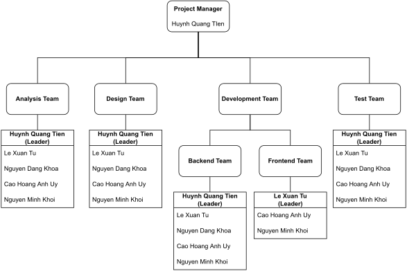

# Project Management Plan

## Overview

### WBS & Estimation

| ID  | WBS Item            | Complexity | Estimated Effort (man-days) |
| --- | ------------------- | ---------- | --------------------------- |
| 1   | Analysis            |            | 20                          |
| 1.1 | SRS                 | Medium     | 5                           |
| 1.2 | UML                 | Simple     | 5                           |
| 1.3 | Technology Research | Medium     | 10                          |
| 2   | Design              |            | 20                          |
| 2.1 | Architecture Design | Medium     | 5                           |
| 2.2 | Database Design     | Medium     | 5                           |
| 2.3 | Detailed Design     | Medium     | 10                          |
| 3   | Development         |            | 80                          |
| 3.1 | Backend             | Medium     | 30                          |
| 3.2 | Frontend            | Medium     | 30                          |
| 3.3 | Blockchain          | Complex    | 10                          |
| 3.4 | OCR                 | Complex    | 10                          |
| 4   | Testing             |            | 15                          |
| 4.1 | Unit Testing        | Simple     | 3                           |
| 4.2 | Integration Testing | Medium     | 5                           |
| 4.3 | System Testing      | Medium     | 7                           |
| 5   | Documentation       |            | 20                          |
| 5.1 | Final Report        | Medium     | 10                          |
| 5.2 | Final Product       | Medium     | 10                          |
| #   | Total               |            | 155                         |

### Project Objectives

* Timeliness: 70%
* Allocated Effort (man-days): 90 days
* Quality Coverage:
  * Reviewing: 100%
  * Unit Test: 95%
  * Integration Test: 95%
  * System Test: 98%
  * User Acceptance Test: 80%

### Project Risks

| Risk                                                                        | Impact | Probability | Mitigation                                                                                                       |
| --------------------------------------------------------------------------- | ------ | ----------- | ---------------------------------------------------------------------------------------------------------------- |
| The team members are not familiar with the technologies used in the project | High   | High        | The team members will be trained before the project starts                                                       |
| The team members can not work together                                      | High   | Medium      | Prepare a team building activity before the project starts                                                       |
| There is not enough time to research the technologies used in the project   | High   | Low         | Find a mentor to help the team members / Find a workaround or similar technology that can be used in the project |

## Management Approach

### Project Process

::: {#fig-project-process}

{#fig-agile}

{#fig-scrum}

Software Development Process Model
:::

Since parts of the requirements are not clear, we will use a process model of the Agile family called Scrum. Using this model, we can understand requirements, adapt changes quickly and deliver target products in a short time to test & review them for next iterations. The project will be divided into 4 iterations (sprints). Each sprint will be a month long and include 2 phases: planning and development. The planning phase will be used to estimate tasks from the product backlog, create a sprint backlog and assign tasks to the team members to develop in the development phase. At the end of the sprint, the team will review the sprint, discuss the problems and changes during the sprint and plan for the next sprint.

### Quality Management

- Reviewing: There will be a meeting every week for the team and the supervisor to review the status of the tasks in the current sprint. The team will show the progress of the tasks and discuss the problems and changes during the sprint. The supervisor will take notes and give advices to the team.
- Defect Prevention: Each change of the code should be reviewed by the code master or the team leader before applying to the main project. They will check for bugs, code smells, anti-patterns and other problems.
- Unit Testing: Each module of the system should be tested before applying to the main project. The team can test the module by themselves or use a testing framework / software to test the module.
- Integration Testing: The team will test the system after each sprint to make sure that the system is working properly. There will be an automatic testing software that includes test scenarios for the system.
- System Testing: The team will test the completed system based on the requirements and the test scenarios. The team can test the system by themselves or use a testing framework / software to test the system.

### Training Plan

| Area               | Participants | When, Duration      | Waiver Criteria            |
| ------------------ | ------------ | ------------------- | -------------------------- |
| Blockchain         | Project Team | 20/07/2022, 2 weeks | Mandatory                  |
| Hyperledger Fabric | Project Team | 01/10/2022, 2 weeks | Mandatory for Backend Team |
| Java, Javalin      | Project Team | 01/09/2022, 1 weeks | Mandatory                  |

## Master Schedule

| Deliverable    | Due        | Deliverable Scope             |
| -------------- | ---------- | ----------------------------- |
| Project Plan   | 05/09/2022 |                               |
| SRS            | 15/09/2022 |                               |
| Design 1       | 15/09/2022 | Architecture Design, Database |
| Design 2       | 30/09/2022 | Detailed Design               |
| Backend        | 30/09/2022 | Code, Test, Deployment        |
| Frontend       | 30/11/2022 | Code, Test, Deployment        |
| Extra Services | 30/11/2022 | Blockchain, OCR               |
| Final Report   | 10/12/2022 |                               |
| Final Product  | 15/12/2022 |                               |

## Project Organization

### Team Structure

{#fig-team-structure}

### Roles

| Role            | Responsibilities                                                                 |
| --------------- | -------------------------------------------------------------------------------- |
| Project Manager | Supervise the project, Manage the team, Manage the schedule, Manage deliverables |
| Analysis Leader | Analyze the requirements, Create SRS, Manage the analysis team                   |
| Analysis Member | Analyze the requirements, Create SRS                                             |
| Design Leader   | Design the system, Create system design document, Manage the design team         |
| Design Member   | Design the system, Create system design document                                 |
| Backend Leader  | Develop the backend, Manage the backend team                                     |
| Backend Member  | Develop the backend                                                              |
| Frontend Leader | Develop the frontend, Manage the frontend team                                   |
| Frontend Member | Develop the frontend                                                             |
| Test Leader     | Test the system, Create test report, Manage the test team                        |
| Test Member     | Test the system, Create test report                                              |

## Project Communication

### Communication Plan

| Item           | Target                    | Purpose                                   | When           | Type          |
| -------------- | ------------------------- | ----------------------------------------- | -------------- | ------------- |
| Discord        | Project Team              | Review meeting & Status report            | Monday, Friday | Voice, Remote |
| Google Meeting | Project Team & Supervisor | Review meeting, Sprint revision & Closeup | Wednesday      | Voice, Remote |
| Messenger      | Project Team & Supervisor | Meeting planning, Q&A & Status report     | Everyday       | Text, Remote  |
| FU Library     | Project Team              | Pair programming & Code review            | Planned        | Offline       |

### External Interfaces

| Function   | Contact Person | Contact Address | Responsibility                                                                                       |
| ---------- | -------------- | --------------- | ---------------------------------------------------------------------------------------------------- |
| Supervisor | Quach Luyl Da  | daql@fpt.edu.vn | Review deliverables, Provide document template, Check project progress, Give advices to project team |

## Configuration Management

### Tools & Infrastructures

#### Common

| Type               | Tool                    |
| ------------------ | ----------------------- |
| Version Control    | Git, GitHub             |
| UML                | PlantUML, Graphviz      |
| Deployment         | Docker                  |
| Project Management | Quarto, GitHub Projects |

### Backend

| Type                 | Tool                                                     |
| -------------------- | -------------------------------------------------------- |
| Programming Language | Java                                                     |
| Library              | Javalin, Fabric SDKs, HSCore, Guava, Genson, EvalEx, JWT |
| Compiler             | JDK, Lombok                                              |
| UI                   | TinyLog, JLine, Fabric CLI                               |
| DBMS                 | H2, Hibernate, Minifabric                                |
| IDE / Editor         | IntelliJ IDEA, VSCode                                    |

### Frontend

| Type                 | Tool       |
| -------------------- | ---------- |
| Programming Language | TypeScript |
| Library              | React      |
| Compiler             | Node       |
| UI                   | React      |
| IDE / Editor         | VSCode     |

### Document Management

We use Quarto to build documents from Markdown files and use GitHub to manage the files and their changes. A participant will create a new branch to edit the files, create pull requests and wait for the project manager to review the changes and merge to the main branch. Then, it'll be built in three outputs: a website using GitHub Pages for visualization, A PDF document & A MS-Word document.

### Source Code Management

We manage the source code by using GitHub. Endpoints of the project will be upload into separated repositories. Once the code is changed, the participant will create a new branch, create a relevant pull request, and wait for code owners to review and merge to the main branch.
