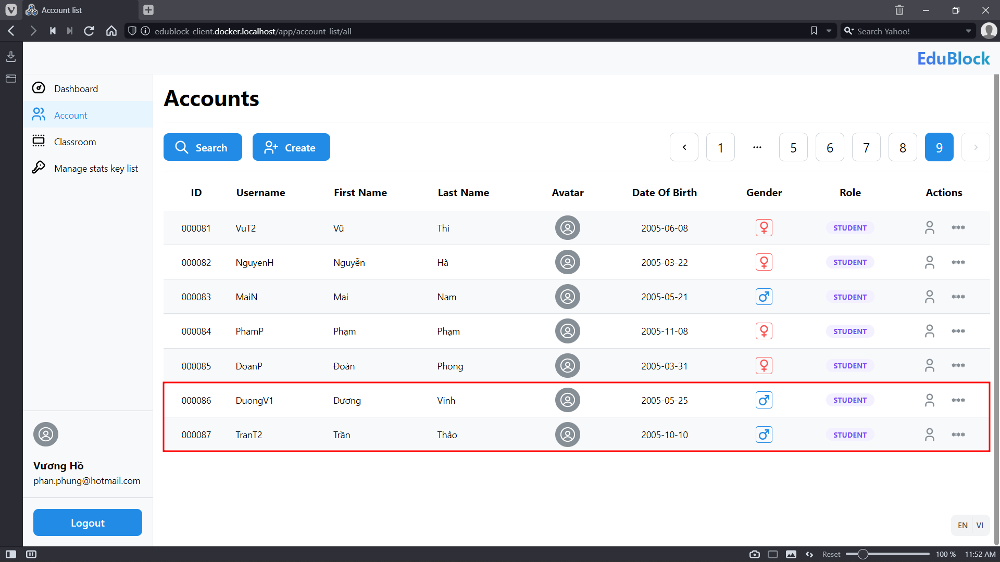
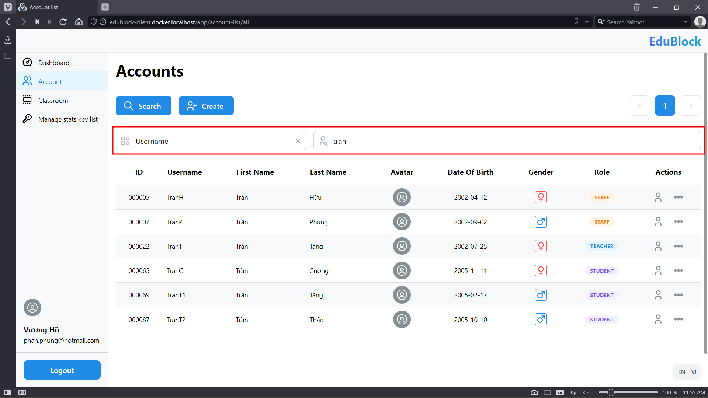
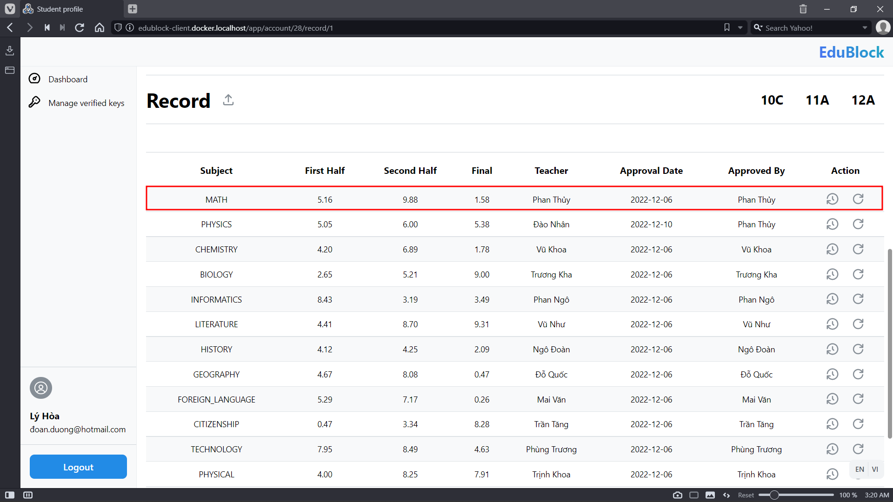

# Release Package & User Guides

## Deliverable Package

### Source Codes & Documents

|       Items        |       Sub-Items        |   Type   | Version |
| :----------------: | :--------------------: | :------: | :-----: |
|      EduBlock      |    EduBlock Client     |   Code   |   1.0   |
|   Request Server   |    EduBlock Backend    |   Code   |   3.0   |
| Blockchain Network |  Blockchain Chaincode  |   Code   |   1.0   |
|        OCR         | Record Table Processor |   Code   |   1.0   |
|    Requirement     |       `SRS.docx`       | Document |   1.0   |
|     Deployment     |    `UserGuide.docx`    | Document |   1.0   |
|    Final Report    |   `FinalReport.docx`   | Document |   1.0   |

: Source code & Documents {#tbl-source-code-documents}

### Known Issues, Limitations & Restrictions

#### Limitations

- Verified records coundn't be synchronized between nodes.
- Verified keys for third-party can only be used in the node it was created.
- Currently network have ability to provide verified data with blockchain technology, and a node can be used as restore point if database of other nodes missing.

## Installation Guides

### System Requirements

OS: any

CPU: at least 4 cores

RAM: at least 4Gb

NETWORK: required

SOFTWARE: Docker

### Setup Files

- `docker-compose.yml`
- `.env`

### Installation Instruction

- Update value in the `.env` as required
- Run command `docker-compose up` to deploy program
- There are many solution to deploy a network. In this scenario, we deploy using virtual network. Other solution can be found [here](https://hyperledger-fabric.readthedocs.io/en/release-2.5/deployment_guide_overview.html)

## User Manual

### Terms & Definitions

| No. | Term     | Definition             |
| --: | -------- | ---------------------- |
|  01 | FT       | Feature                |
|  02 | GUEST    | Guest, Third-party     |
|  03 | ADMIN    | Admin                  |
|  04 | STAFF    | Staff                  |
|  05 | TEACHER  | Teacher                |
|  06 | STUDENT  | Student                |
|  07 | AUTH     | Any authenticated role |
|  08 | MAN      | Admin or Staff         |
|  09 | USER     | Teacher or Student     |
|  10 | PERSONAL | Personal               |

: Terms & Definitions {#tbl-terms-definitions}

### System Requirements

OS: any

CPU: any

RAM: at least 1Gb

NETWORK: required

### Application Usage

#### Overview

| No. | Feature                                        | ADMIN | STAFF | TEACHER | STUDENT | GUEST | Note |
| --: | :--------------------------------------------- | :---: | :---: | :-----: | :-----: | :---: | :--: |
|  01 | Login                                          |   x   |   x   |    x    |    x    |       |      |
|  02 | View list of all accounts                      |   x   |   x   |         |         |       |      |
|  03 | View details of an account                     |   x   |   x   |         |         |       |      |
|  04 | Create new accounts                            |   x   |       |         |         |       |      |
|  05 | Search account                                 |   x   |   x   |         |         |       |      |
|  06 | Update own profile                             |   x   |   x   |    x    |    x    |       |      |
|  07 | Change others account password                 |   x   |       |         |         |       |      |
|  08 | Get classification report of year and grade    |   x   |   x   |         |         |       |      |
|  09 | Get report of a classroom                      |   x   |   x   |    x    |         |       |      |
|  10 | View list of all classrooms                    |   x   |   x   |         |         |       |      |
|  11 | View details of a classroom                    |   x   |   x   |    x    |    x    |       |      |
|  12 | Create new classroom                           |       |   x   |         |         |       |      |
|  13 | Update details of a classroom                  |       |   x   |         |         |       |      |
|  14 | View list of students of a classroom           |   x   |   x   |    x    |         |       |      |
|  15 | Assign multiple students to a classroom        |       |   x   |         |         |       |      |
|  16 | View details of a student                      |   x   |   x   |    x    |         |       |      |
|  17 | Update details of a student                    |       |   x   |         |         |       |      |
|  18 | Remove a student from classroom                |       |   x   |         |         |       |      |
|  19 | View list of teachers of a classroom           |   x   |   x   |    x    |    x    |       |      |
|  20 | Assign multiple teachers to a classroom        |       |   x   |         |         |       |      |
|  21 | Remove a teacher from classroom                |       |   x   |         |         |       |      |
|  22 | Print record table of a student                |   x   |   x   |    x    |    x    |       |      |
|  23 | View own profile                               |   x   |   x   |    x    |    x    |       |      |
|  24 | Update own password                            |   x   |   x   |    x    |    x    |       |      |
|  25 | View teaching classrooms                       |       |       |    x    |         |       |      |
|  26 | Request update record of student               |       |       |    x    |    x    |       |      |
|  27 | Request update record of student by image      |       |       |    x    |    x    |       |      |
|  28 | Update a record of student                     |       |       |    x    |         |       |      |
|  29 | View list of pending record's update requests  |       |       |    x    |         |       |      |
|  30 | Approve or reject record update request        |       |       |    x    |         |       |      |
|  31 | View update history of a record of student     |   x   |   x   |    x    |    x    |       |      |
|  32 | View list of classroom taking part in          |       |       |         |    x    |       |      |
|  33 | View own records                               |       |       |         |    x    |       |      |
|  34 | Create key to view records of a student        |       |       |         |    x    |       |      |
|  35 | View list of keys to view records of a student |       |       |         |    x    |       |      |
|  36 | Remove a key to view records of a student      |       |       |         |    x    |       |      |
|  37 | Create key to view records of students         |   x   |   x   |         |         |       |      |
|  38 | View list of keys to view records of students  |   x   |   x   |         |         |       |      |
|  39 | Remove a key to view records of students       |   x   |   x   |         |         |       |      |
|  40 | View verified records of a student             |   x   |   x   |    x    |    x    |   x   |      |
|  41 | View verified records of students              |   x   |   x   |    x    |    x    |   x   |      |

: Feature Matrix {#tbl-feature-matrix}

#### Login

| Step | Description                                     | Effect                                       | Figure           |
| ---: | :---------------------------------------------- | :------------------------------------------- | ---------------- |
|   01 | Click <kbd>Login</kbd> in the homepage          | Navigate to login page                       | @fig-ug-01-step1 |
|   02 | Fill the form with provided credential          |                                              | @fig-ug-01-step2 |
|   03 | Click <kbd>Login</kbd> to submit the credential | Navigate to dashboard if credential is valid | @fig-ug-01-step3 |

{#fig-ug-01-step1}

{#fig-ug-01-step2}

{#fig-ug-01-step3}

{#fig-ug-01-result}

#### View list of all accounts

| Step | Description                                     | Effect                            | Figure           |
| ---: | :---------------------------------------------- | :-------------------------------- | ---------------- |
|   01 | Click on <kbd>Account</kbd> in the left sidebar | Navigate to the account list page | @fig-ug-02-step1 |

{#fig-ug-02-step1}

{#fig-ug-02-result}

#### View details of an account

| Step | Description                                                      | Effect                                 | Figure           |
| ---: | :--------------------------------------------------------------- | :------------------------------------- | ---------------- |
|   01 | Click on <kbd>Account</kbd> in the left sidebar                  | Navigate to the account list page      | @fig-ug-03-step1 |
|   02 | Find the target account                                          |                                        | @fig-ug-03-step2 |
|   03 | Click on <kbd>Details</kbd> in the `Actions` column of the table | Navigate to the account's profile page | @fig-ug-03-step3 |

{#fig-ug-03-step1}

{#fig-ug-03-step2}

{#fig-ug-03-step3}

{#fig-ug-03-result}

#### Create new accounts

| Step | Description                                                   | Effect                                | Figure           |
| ---: | :------------------------------------------------------------ | :------------------------------------ | ---------------- |
|   00 | Follow `Feature 02` to navigate to the account list page      |                                       |                  |
|   01 | Click on <kbd>Create</kbd> to open the accounts creation form | A modal with form show up             | @fig-ug-04-step1 |
|   02 | Fill the form with desired values                             |                                       | @fig-ug-04-step2 |
|   03 | Click on <kbd>Create Accounts</kbd>                           | New accounts added at the end of list | @fig-ug-04-step3 |

{#fig-ug-04-step1}

{#fig-ug-04-step2}

{#fig-ug-04-step3}

{#fig-ug-04-result}

#### Search an account

| Step | Description                                              | Effect                                            | Figure           |
| ---: | :------------------------------------------------------- | :------------------------------------------------ | ---------------- |
|   00 | Follow `Feature 02` to navigate to the account list page |                                                   |                  |
|   01 | Click on <kbd>Search</kbd> to show search input          | Search input visible                              | @fig-ug-05-step1 |
|   02 | Fill the input with desired values                       | List of accounts auto refreshed with search value | @fig-ug-05-step2 |

{#fig-ug-05-step1}

{#fig-ug-05-step2}

{#fig-ug-05-result}

#### Update own profile

| Step | Description                                                    | Effect                         | Figure           |
| ---: | :------------------------------------------------------------- | :----------------------------- | ---------------- |
|   01 | Click on Account name in the left sidebar                      | Navigate to the profile page   | @fig-ug-06-step1 |
|   02 | Click on <kbd>Update profile</kbd> to open profile update form | A modal with form show up      | @fig-ug-06-step2 |
|   03 | Fill the form with desired values                              |                                | @fig-ug-06-step3 |
|   04 | Click on <kbd>Submit</kbd>                                     | Update if form values is valid | @fig-ug-06-step4 |

{#fig-ug-06-step1}

{#fig-ug-06-step2}

{#fig-ug-06-step3}

{#fig-ug-06-step4}

{#fig-ug-06-result}

#### Change other's password

| Step | Description                                                 | Effect                              | Figure           |
| ---: | :---------------------------------------------------------- | :---------------------------------- | ---------------- |
|   00 | Follow `Feature 02` to navigate to the account list page    |                                     |                  |
|   01 | Find the target account                                     |                                     | @fig-ug-07-step1 |
|   02 | Click on <kbd>Update password</kbd> in the `Actions` column | A modal with form show up           | @fig-ug-07-step2 |
|   03 | Fill the form with desired values                           |                                     | @fig-ug-07-step3 |
|   04 | Click on <kbd>Update</kbd>                                  | Password for target account updated | @fig-ug-07-step4 |

{#fig-ug-07-step1}

{#fig-ug-07-step2}

{#fig-ug-07-step3}

{#fig-ug-07-step4}

#### Get classification report of grade and year

| Step | Description                                                                  | Effect                               | Figure           |
| ---: | :--------------------------------------------------------------------------- | :----------------------------------- | ---------------- |
|   01 | Click on <kbd>Dashboard</kbd> in the left sidebar                            | Navigate to the dashboard page       | @fig-ug-08-step1 |
|   02 | Select grade and year                                                        |                                      | @fig-ug-08-step2 |
|   03 | Click on <kbd>Get grade report</kbd> or <kbd>Get classification report</kbd> | Report file can be download if exist | @fig-ug-08-step3 |

{#fig-ug-08-step1}

{#fig-ug-08-step2}

{#fig-ug-08-step3}

{#fig-ug-08-result}

#### Get report of a classroom

| Step | Description                                                              | Effect                                 | Figure           |
| ---: | :----------------------------------------------------------------------- | :------------------------------------- | ---------------- |
|   01 | Click on <kbd>Classroom</kbd> in the left sidebar                        | Navigate to the classroom list page    | @fig-ug-09-step1 |
|   02 | Find the target classroom                                                |                                        | @fig-ug-09-step2 |
|   03 | Click on <kbd>Details</kbd> in the `Actions` column                      | Navigate to the classroom details page | @fig-ug-09-step3 |
|   04 | Click on <kbd>Get semester report</kbd> or <kbd>Get subject report</kbd> | Report file can be download            | @fig-ug-09-step4 |

{#fig-ug-09-step1}

{#fig-ug-09-step2}

{#fig-ug-09-step3}

{#fig-ug-09-step4}

{#fig-ug-09-result}

#### View list of all classrooms

| Step | Description                                       | Effect                              | Figure           |
| ---: | :------------------------------------------------ | :---------------------------------- | ---------------- |
|   01 | Click on <kbd>Classroom</kbd> in the left sidebar | Navigate to the classroom list page | @fig-ug-10-step1 |

{#fig-ug-10-step1}

{#fig-ug-10-result}

#### View details of a classroom

##### MAN

| Step | Description                                                | Effect                                 | Figure                |
| ---: | :--------------------------------------------------------- | :------------------------------------- | --------------------- |
|   00 | Follow `Feature 10` to navigate to the classroom list page |                                        |                       |
|   01 | Find the target classroom                                  |                                        | @fig-ug-11-step1-rman |
|   02 | Click on <kbd>Details</kbd> in the `Actions` column        | Navigate to the classroom details page | @fig-ug-11-step2-rman |

{#fig-ug-11-step1-rman}

{#fig-ug-11-step2-rman}

{#fig-ug-11-result-rman}

##### USER

| Step | Description                                         | Effect                                 | Figure                |
| ---: | :-------------------------------------------------- | :------------------------------------- | --------------------- |
|   01 | Click on <kbd>Dashboard</kbd> in the left sidebar   | Navigate to the dashboard page         | @fig-ug-11-step1-rusr |
|   02 | Find the target classroom                           |                                        | @fig-ug-11-step2-rusr |
|   03 | Click on <kbd>Details</kbd> in the `Actions` column | Navigate to the classroom details page | @fig-ug-11-step3-rusr |

{#fig-ug-11-step1-rusr}

{#fig-ug-11-step2-rusr}

{#fig-ug-11-step3-rusr}

{#fig-ug-11-result-rusr}

#### Create new classroom

| Step | Description                                            | Effect                    | Figure           |
| ---: | :----------------------------------------------------- | :------------------------ | ---------------- |
|   00 | Follow `Feature 10` to navigate to classroom list page |                           |                  |
|   01 | Click on <kbd>Create</kbd>                             | A modal with form show up | @fig-ug-12-step1 |
|   02 | Fill the form with desired value                       |                           | @fig-ug-12-step2 |
|   03 | Click on <kbd>Create classroom</kbd>                   | New classroom created     | @fig-ug-12-step3 |

{#fig-ug-12-step1}

{#fig-ug-12-step2}

{#fig-ug-12-step3}

<!-- {#fig-ug-12-result} -->

#### Update details of a classroom

| Step | Description                                                 | Effect                    | Figure           |
| ---: | :---------------------------------------------------------- | :------------------------ | ---------------- |
|   00 | Follow `Feature 11` to navigate to target classroom details |                           |                  |
|   01 | Click on <kbd>Update details</kbd>                          | A modal with form show up | @fig-ug-13-step1 |
|   02 | Fill the form with desired value                            |                           | @fig-ug-13-step2 |
|   03 | Click on <kbd>Update</kbd>                                  | Classroom details updated | @fig-ug-13-step3 |

{#fig-ug-13-step1}

{#fig-ug-13-step2}

{#fig-ug-13-step3}

<!-- {#fig-ug-13-result} -->

#### View list of students of a classroom

| Step | Description                                                 | Effect | Figure           |
| ---: | :---------------------------------------------------------- | :----- | ---------------- |
|   00 | Follow `Feature 11` to navigate to target classroom details |        |                  |
|   01 | Click on <kbd>Students</kbd>                                |        | @fig-ug-14-step1 |

{#fig-ug-14-step1}

{#fig-ug-14-result}

#### Assign multiple students to classroom

| Step | Description                                                         | Effect                                 | Figure           |
| ---: | :------------------------------------------------------------------ | :------------------------------------- | ---------------- |
|   00 | Follow `Feature 14` to navigate to student list of target classroom |                                        |                  |
|   01 | Click on <kbd>Add students</kbd>                                    | A modal with form show up              | @fig-ug-15-step1 |
|   02 | Fill the form with desired value                                    |                                        | @fig-ug-15-step2 |
|   03 | Click on <kbd>Confirm</kbd>                                         | New student appear in target classroom | @fig-ug-15-step3 |

{#fig-ug-15-step1}

{#fig-ug-15-step2}

{#fig-ug-15-step3}

<!-- {#fig-ug-15-result} -->

#### View details of a student

##### MAN

| Step | Description                                         | Effect                                 | Figure                |
| ---: | :-------------------------------------------------- | :------------------------------------- | --------------------- |
|   00 | Follow `Feature 02` to navigate to list of accounts |                                        |                       |
|   01 | Find the target student                             |                                        | @fig-ug-16-step1-rman |
|   02 | Click on <kbd>Details</kbd> on the `Actions` column | Navigate to the target student profile | @fig-ug-16-step2-rman |

{#fig-ug-16-step1-rman}

{#fig-ug-16-step2-rman}

{#fig-ug-16-result-rman}

##### TEACHER

| Step | Description                                                    | Effect                                 | Figure                |
| ---: | :------------------------------------------------------------- | :------------------------------------- | --------------------- |
|   00 | Follow `Feature 14` to navigate to student list of a classroom |                                        |                       |
|   01 | Find the target student                                        |                                        | @fig-ug-16-step1-rtch |
|   02 | Click on <kbd>Details</kbd> on the `Actions` column            | Navigate to the target student profile | @fig-ug-16-step2-rtch |

{#fig-ug-16-step1-rtch}

{#fig-ug-16-step2-rtch}

{#fig-ug-16-result-rtch}

#### Update details of a student

| Step | Description                                        | Effect                                             | Figure           |
| ---: | :------------------------------------------------- | :------------------------------------------------- | ---------------- |
|   00 | Follow `Feature 16` to navigate to student profile |                                                    |                  |
|   01 | Click on <kbd>Update</kbd>                         | A modal with form show up                          | @fig-ug-17-step1 |
|   02 | Fill the form with desired values                  |                                                    | @fig-ug-17-step2 |
|   03 | Click on <kbd>Confirm</kbd>                        | Student information updated if provided form valid | @fig-ug-17-step3 |

{#fig-ug-17-step1}

{#fig-ug-17-step2}

{#fig-ug-17-step3}

<!-- {#fig-ug-17-result} -->

#### Remove a student from classroom

| Step | Description                                                    | Effect                                | Figure           |
| ---: | :------------------------------------------------------------- | :------------------------------------ | ---------------- |
|   00 | Follow `Feature 14` to navigate to student list of a classroom |                                       |                  |
|   01 | Find the target student                                        |                                       | @fig-ug-18-step1 |
|   02 | Click on <kbd>Remove</kbd> on the `Actions` column             | Target student removed from classroom | @fig-ug-18-step2 |

{#fig-ug-18-step1}

{#fig-ug-18-step2}

<!-- {#fig-ug-18-result} -->

#### View list of teachers of a classroom

| Step | Description                                          | Effect | Figure           |
| ---: | :--------------------------------------------------- | :----- | ---------------- |
|   00 | Follow `Feature 11` to navigate to classroom details |        |                  |
|   01 | Click on <kbd>Teachers</kbd>                         |        | @fig-ug-19-step1 |

{#fig-ug-19-step1}

{#fig-ug-19-result}

#### Assign multiple teachers to a classroom

| Step | Description                                                    | Effect                                 | Figure           |
| ---: | :------------------------------------------------------------- | :------------------------------------- | ---------------- |
|   00 | Follow `Feature 19` to navigate to teacher list of a classroom |                                        |                  |
|   01 | Click on <kbd>Add teachers</kbd>                               | A modal with form show up              | @fig-ug-20-step1 |
|   02 | Fill the form with desired values                              |                                        | @fig-ug-20-step2 |
|   03 | Click on <kbd>Confirm</kbd>                                    | New teachers added to target classroom | @fig-ug-20-step3 |

{#fig-ug-20-step1}

{#fig-ug-20-step2}

{#fig-ug-20-step3}

<!-- {#fig-ug-20-result} -->

#### Remove a teacher from classroom

| Step | Description                                                    | Effect                                | Figure           |
| ---: | :------------------------------------------------------------- | :------------------------------------ | ---------------- |
|   00 | Follow `Feature 19` to navigate to teacher list of a classroom |                                       |                  |
|   01 | Find the target teacher                                        |                                       | @fig-ug-21-step1 |
|   02 | Click on <kbd>Remove</kbd>                                     | Target teacher removed from classroom | @fig-ug-21-step2 |

{#fig-ug-21-step1}

{#fig-ug-21-step2}

<!-- {#fig-ug-21-result} -->

#### Print record table of a student

| Step | Description                                        | Effect               | Figure           |
| ---: | :------------------------------------------------- | :------------------- | ---------------- |
|   00 | Follow `Feature 16` to navigate to student profile |                      |                  |
|   01 | Select a classroom of the target student           |                      | @fig-ug-22-step1 |
|   02 | Click on <kbd>Print record</kbd>                   | Print dialog show up | @fig-ug-22-step2 |

{#fig-ug-22-step1}

{#fig-ug-22-step2}

{#fig-ug-22-result}

#### View own profile

| Step | Description                               | Effect                       | Figure           |
| ---: | :---------------------------------------- | :--------------------------- | ---------------- |
|   01 | Click on Account name in the left sidebar | Navigate to the profile page | @fig-ug-23-step1 |

{#fig-ug-23-step1}

{#fig-ug-23-result}

#### Update own password

| Step | Description                                     | Effect                   | Figure           |
| ---: | :---------------------------------------------- | :----------------------- | ---------------- |
|   00 | Follow `Feature 23` to navigate to profile page |                          |                  |
|   01 | Click on <kbd>Change password</kbd>             | A modal with form appear | @fig-ug-24-step1 |
|   02 | Fill the form with desired values               |                          | @fig-ug-24-step2 |
|   03 | Click on <kbd>Submit</kbd>                      | Password updated         | @fig-ug-24-step3 |

{#fig-ug-24-step1}

{#fig-ug-24-step2}

{#fig-ug-24-step3}

#### View teaching classroom

| Step | Description                   | Effect                          | Figure           |
| ---: | :---------------------------- | :------------------------------ | ---------------- |
|   01 | Click on <kbd>Dashboard</kbd> | Show list of teaching classroom | @fig-ug-25-step1 |

{#fig-ug-25-step1}

#### Request record update

##### TEACHER

| Step | Description                                                | Effect                                          | Figure                |
| ---: | :--------------------------------------------------------- | :---------------------------------------------- | --------------------- |
|   00 | Follow `Feature 25` to navigate to teaching classroom list |                                                 |                       |
|   01 | Click <kbd>Details</kbd> in the `Actions` column           | Navigate to classroom details                   | @fig-ug-26-step1-rtch |
|   02 | Click <kbd>Students</kbd>                                  | Navigate to classroom student list              | @fig-ug-26-step2-rtch |
|   03 | Find the target student                                    |                                                 | @fig-ug-26-step3-rtch |
|   04 | Click on <kbd>Details</kbd> in the `Actions` column        | Navigate to student record of current classroom | @fig-ug-26-step4-rtch |
|   05 | Find the target record                                     |                                                 | @fig-ug-26-step5-rtch |
|   06 | Click on <kbd>Request</kbd> in the `Actions` column        | A modal with form show up                       | @fig-ug-26-step6-rtch |
|   07 | Fill the form with desired values                          |                                                 | @fig-ug-26-step7-rtch |
|   08 | Click on <kbd>Request</kbd>                                | Request sent                                    | @fig-ug-26-step8-rtch |

{#fig-ug-26-step1-rtch}

{#fig-ug-26-step2-rtch}

{#fig-ug-26-step3-rtch}

{#fig-ug-26-step4-rtch}

{#fig-ug-26-step5-rtch}

{#fig-ug-26-step6-rtch}

{#fig-ug-26-step7-rtch}

{#fig-ug-26-step8-rtch}

<!-- {#fig-ug-26-result-rtch} -->

##### STUDENT

| Step | Description                                         | Effect                                 | Figure                |
| ---: | :-------------------------------------------------- | :------------------------------------- | --------------------- |
|   00 | Follow `Feature 23` to navigate to profile page     |                                        |                       |
|   01 | Find the target classroom                           | Record data switch to target classroom | @fig-ug-26-step1-rstd |
|   02 | Find the target record                              |                                        | @fig-ug-26-step2-rstd |
|   03 | Click on <kbd>Request</kbd> in the `Actions` column | A modal with form show up              | @fig-ug-26-step3-rstd |
|   04 | Fill the form with desired values                   |                                        | @fig-ug-26-step4-rstd |
|   05 | Click on <kbd>Request</kbd>                         | Request sent                           | @fig-ug-26-step5-rstd |

{#fig-ug-26-step1-rstd}

{#fig-ug-26-step2-rstd}

{#fig-ug-26-step3-rstd}

{#fig-ug-26-step4-rstd}

{#fig-ug-26-step5-rstd}

<!-- {#fig-ug-26-result-rstd} -->

#### Request record update by legacy record image

##### TEACHER

| Step | Description                                                | Effect                                          | Figure                |
| ---: | :--------------------------------------------------------- | :---------------------------------------------- | --------------------- |
|   00 | Follow `Feature 25` to navigate to teaching classroom list |                                                 |                       |
|   01 | Click <kbd>Details</kbd> in the `Actions` column           | Navigate to classroom details                   | @fig-ug-27-step1-rtch |
|   02 | Click <kbd>Students</kbd>                                  | Navigate to classroom student list              | @fig-ug-27-step2-rtch |
|   03 | Find the target student                                    |                                                 | @fig-ug-27-step3-rtch |
|   04 | Click on <kbd>Details</kbd> in the `Actions` column        | Navigate to student record of current classroom | @fig-ug-27-step4-rtch |
|   05 | Click on <kbd>Upload</kbd> next to Record Heading          | A modal with form show up                       | @fig-ug-27-step5-rtch |
|   06 | Fill the form with desired values                          |                                                 | @fig-ug-27-step6-rtch |
|   07 | Click on <kbd>Submit</kbd>                                 | Request sent                                    | @fig-ug-27-step7-rtch |

{#fig-ug-27-step1-rtch}

{#fig-ug-27-step2-rtch}

{#fig-ug-27-step3-rtch}

{#fig-ug-27-step4-rtch}

{#fig-ug-27-step5-rtch}

{#fig-ug-27-step6-rtch}

{#fig-ug-27-step7-rtch}

<!-- {#fig-ug-27-result-rtch} -->

##### STUDENT

| Step | Description                                       | Effect                                 | Figure                |
| ---: | :------------------------------------------------ | :------------------------------------- | --------------------- |
|   00 | Follow `Feature 23` to navigate to profile page   |                                        |                       |
|   01 | Find the target classroom                         | Record data switch to target classroom | @fig-ug-27-step1-rstd |
|   02 | Click on <kbd>Upload</kbd> next to Record Heading | A modal with form show up              | @fig-ug-27-step2-rstd |
|   03 | Fill the form with desired values                 |                                        | @fig-ug-27-step3-rstd |
|   04 | Click on <kbd>Submit</kbd>                        | Request sent                           | @fig-ug-27-step4-rstd |

{#fig-ug-27-step1-rstd}

{#fig-ug-27-step2-rstd}

{#fig-ug-27-step3-rstd}

{#fig-ug-27-step4-rstd}

#### Update a record of student

| Step | Description                                                | Effect                                          | Figure           |
| ---: | :--------------------------------------------------------- | :---------------------------------------------- | ---------------- |
|   00 | Follow `Feature 25` to navigate to teaching classroom list |                                                 |                  |
|   01 | Click <kbd>Details</kbd> in the `Actions` column           | Navigate to classroom details                   | @fig-ug-28-step1 |
|   02 | Click <kbd>Students</kbd>                                  | Navigate to classroom student list              | @fig-ug-28-step2 |
|   03 | Find the target student                                    |                                                 | @fig-ug-28-step3 |
|   04 | Click on <kbd>Details</kbd> in the `Actions` column        | Navigate to student record of current classroom | @fig-ug-28-step4 |
|   05 | Find the target record                                     |                                                 | @fig-ug-28-step5 |
|   06 | Click on <kbd>Request</kbd> in the `Actions` column        | A modal with form show up                       | @fig-ug-28-step6 |
|   07 | Fill the form with desired values                          |                                                 | @fig-ug-28-step7 |
|   08 | Click on <kbd>Request</kbd>                                | Record updated                                  | @fig-ug-28-step8 |

{#fig-ug-28-step1}

{#fig-ug-28-step2}

{#fig-ug-28-step3}

{#fig-ug-28-step4}

{#fig-ug-28-step5}

{#fig-ug-28-step6}

{#fig-ug-28-step7}

{#fig-ug-28-step8}

<!-- {#fig-ug-28-result} -->

#### View list of pending record update requests

| Step | Description                                                 | Effect                   | Figure           |
| ---: | :---------------------------------------------------------- | :----------------------- | ---------------- |
|   01 | Click on <kbd>Pending request</kbd> in the `Actions` column | Navigate to request list | @fig-ug-29-step1 |

{#fig-ug-29-step1}

<!-- {#fig-ug-29-result} -->

#### Approve or reject record update request

| Step | Description                                               | Effect                 | Figure           |
| ---: | :-------------------------------------------------------- | :--------------------- | ---------------- |
|   00 | Follow `Feature 29` to navigate to request list page      |                        |                  |
|   01 | Find the target request                                   |                        | @fig-ug-30-step1 |
|   02 | Click <kbd>Approve</kbd> or <kbd>Reject</kbd> the request | Request status changed | @fig-ug-30-step2 |

{#fig-ug-30-step1}

{#fig-ug-30-step2}

<!-- {#fig-ug-30-result} -->

#### View update history of a record of student

| Step | Description                                        | Effect                                 | Figure           |
| ---: | :------------------------------------------------- | :------------------------------------- | ---------------- |
|   00 | Follow `Feature 16` to navigate to student profile |                                        |                  |
|   01 | Find the target classroom                          | Record data switch to target classroom | @fig-ug-31-step1 |
|   02 | Find the target record                             |                                        | @fig-ug-31-step2 |
|   03 | Hover <kbd>History</kbd> in the `Actions` column   | A temporary card show update history   | @fig-ug-31-step3 |

{#fig-ug-31-step1}

{#fig-ug-31-step2}

{#fig-ug-31-step3}

#### View list of classroom taking part in

| Step | Description                   | Effect                     | Figure           |
| ---: | :---------------------------- | :------------------------- | ---------------- |
|   01 | Click on <kbd>Dashboard</kbd> | Navigate to classroom list | @fig-ug-32-step1 |

{#fig-ug-32-step1}

<!-- {#fig-ug-32-result} -->

#### View own records

| Step | Description                                        | Effect | Figure |
| ---: | :------------------------------------------------- | :----- | ------ |
|   00 | Follow `Feature 23` to navigate to own record page |        |        |

<!-- {#fig-ug-33-step1} -->

<!-- {#fig-ug-33-result} -->

#### Create key to view records of a student

| Step | Description                              | Effect                             | Figure           |
| ---: | :--------------------------------------- | :--------------------------------- | ---------------- |
|   01 | Click on <kbd>Manage verified keys</kbd> | Navigate to verified key list page | @fig-ug-34-step1 |
|   02 | Click on <kbd>Create new key</kbd>       | new key created                    | @fig-ug-34-step2 |

{#fig-ug-34-step1}

{#fig-ug-34-step2}

<!-- {#fig-ug-34-result} -->

#### View list of keys to view records of a student

| Step | Description                              | Effect                             | Figure           |
| ---: | :--------------------------------------- | :--------------------------------- | ---------------- |
|   01 | Click on <kbd>Manage verified keys</kbd> | Navigate to verified key list page | @fig-ug-35-step1 |

{#fig-ug-35-step1}

<!-- {#fig-ug-35-result} -->

#### Remove a key to view records of a student

| Step | Description                                                      | Effect             | Figure           |
| ---: | :--------------------------------------------------------------- | :----------------- | ---------------- |
|   00 | Follow `Feature 35` to navigate to the list of verified key page |                    |                  |
|   01 | Find the target key                                              |                    | @fig-ug-36-step1 |
|   01 | Click on <kbd>Remove</kbd>                                       | Target key removed | @fig-ug-36-step2 |

{#fig-ug-36-step1}

{#fig-ug-36-step2}

<!-- {#fig-ug-36-result} -->

#### Create key to view records of students

| Step | Description                               | Effect                             | Figure           |
| ---: | :---------------------------------------- | :--------------------------------- | ---------------- |
|   01 | Click on <kbd>Manage stats key list</kbd> | Navigate to verified key list page | @fig-ug-37-step1 |
|   02 | Select year and grade for the key         |                                    | @fig-ug-37-step2 |
|   02 | Click on <kbd>Create new key</kbd>        | new key created                    | @fig-ug-37-step3 |

{#fig-ug-37-step1}

{#fig-ug-37-step2}

{#fig-ug-37-step3}

<!-- {#fig-ug-37-result} -->

#### View list of keys to view records of students

| Step | Description                               | Effect                             | Figure           |
| ---: | :---------------------------------------- | :--------------------------------- | ---------------- |
|   01 | Click on <kbd>Manage stats key list</kbd> | Navigate to verified key list page | @fig-ug-38-step1 |

{#fig-ug-38-step1}

<!-- {#fig-ug-38-result} -->

#### Remove a key to view records of students

| Step | Description                                                      | Effect             | Figure           |
| ---: | :--------------------------------------------------------------- | :----------------- | ---------------- |
|   00 | Follow `Feature 38` to navigate to the list of verified key page |                    |                  |
|   01 | Find the target key                                              |                    | @fig-ug-39-step1 |
|   01 | Click on <kbd>Remove</kbd>                                       | Target key removed | @fig-ug-39-step2 |

{#fig-ug-39-step1}

{#fig-ug-39-step2}

<!-- {#fig-ug-39-result} -->

#### View verified records of a student

| Step | Description                          | Effect                                 | Figure           |
| ---: | :----------------------------------- | :------------------------------------- | ---------------- |
|   01 | Press <kbd>Ctrl</kbd> + <kbd>K</kbd> | A command pallette show up             | @fig-ug-40-step1 |
|   02 | Select `View verified data`          | Navigate to verified data page         | @fig-ug-40-step2 |
|   02 | Input key                            | Show verified data of the provided key | @fig-ug-40-step3 |

{#fig-ug-40-step1}

{#fig-ug-40-step2}

{#fig-ug-40-step3}

{#fig-ug-40-result}

#### View verified records of students

| Step | Description                          | Effect                                 | Figure           |
| ---: | :----------------------------------- | :------------------------------------- | ---------------- |
|   01 | Press <kbd>Ctrl</kbd> + <kbd>K</kbd> | A command pallette show up             | @fig-ug-41-step1 |
|   02 | Select `View verified data list`     | Navigate to verified data page         | @fig-ug-41-step2 |
|   02 | Input key                            | Show verified data of the provided key | @fig-ug-41-step3 |

{#fig-ug-41-step1}

{#fig-ug-41-step2}

{#fig-ug-41-step3}

{#fig-ug-41-result}

### Troubleshooting
