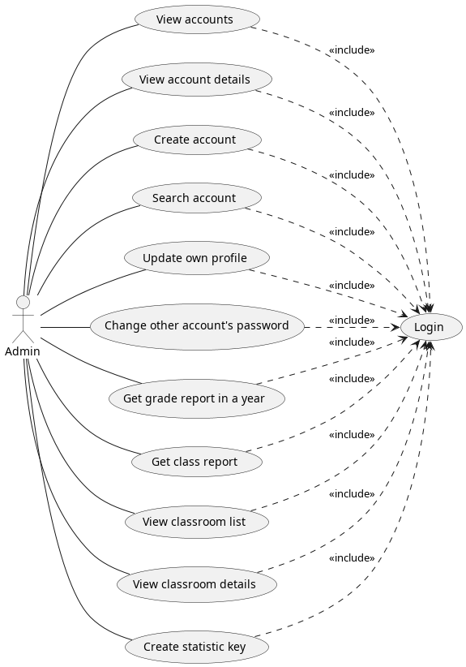
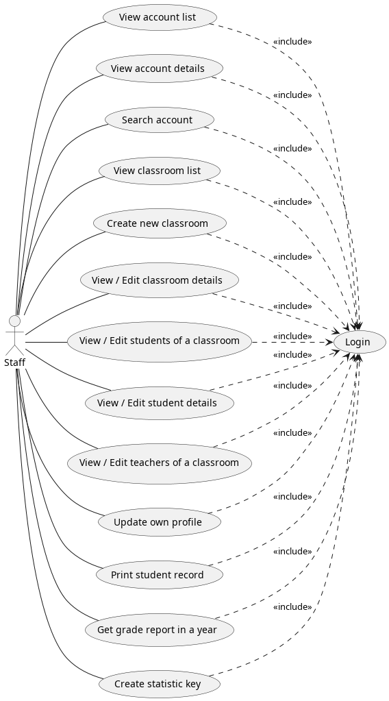
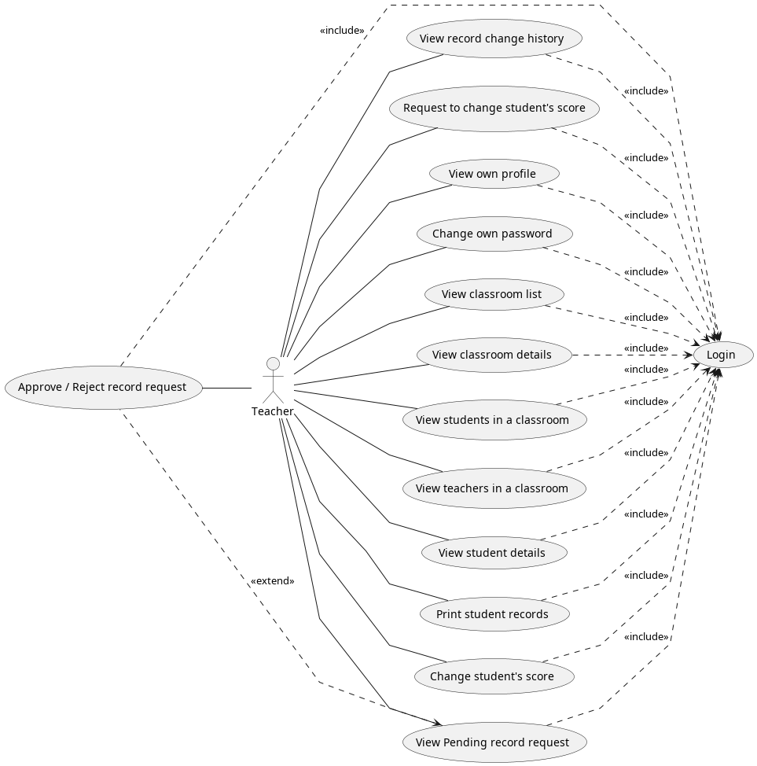
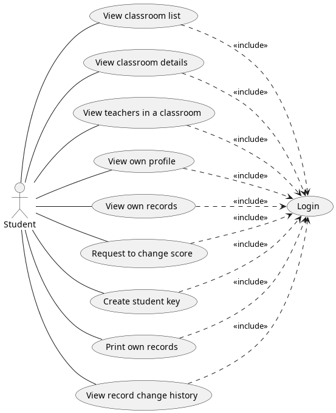
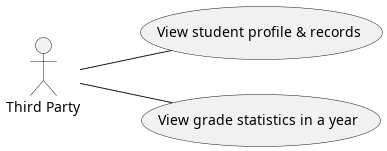

# Software Requirement Specification

## Overall Description

### Product Overview

This is the software requirement specification for the project "EduBlock". EduBlock is an web-application that will help the school to manage their student's records, more specifically, the students and teachers can reduce paper's work to manage their records. Lately, the school has been using paper to manage their student's record, which is not efficient and not environmentally. EduBlock will help the school to manage their student's records in a more efficient way, although there are some other third-party apps that can help schools to manage student's records nowadays, but it is not really efficient and safe. Our application uses blockchain technology to make sure the data is safe and secure. Every step of the process that needs to be worked with records will be tracked by EduBlock, so the school can easily track the data changes and make sure the data is not being tampered.

### Business Rules

| **ID** | **Rules Description**                                                                                                                                                                                                     |
| :----- | :------------------------------------------------------------------------------------------------------------------------------------------------------------------------------------------------------------------------ |
| BR-1   | The application will be used by the students, teachers, staff and admin.                                                                                                                                                  |
| BR-2   | Only Staff have permission to manage classroom including create new class, edit class, assign or remove teacher from the class, assign student to class, remove student from class, edit student information.             |
| BR-3   | Only Admin have permission to create new account(s).                                                                                                                                                                      |
| BR-4   | Only Teacher who teach the subject can edit the grade of the student.                                                                                                                                                     |
| BR-5   | Student can only view their class, profile and academic record.                                                                                                                                                           |
| BR-6   | In Blockchain, the data is immutable, so the data cannot be changed once it is created. Because of this, the data can just be appended, can't be edited or deleted, this will help ensure the student's record is safe and secure. |
| BR-7   | A node if wants to join the network, it must have other nodes permission or the node must be approved by the admin.                                                                                                        |
| BR-8   | In a private blockchain, every node knows each other, which node own the data. Data is shared between nodes so the data can be recovered if one node is down.                                                                |
| BR-9   | Other nodes can only read the data, they cannot change the data.                                                                                                                                                          |
| BR-10  | Third-party's member can only view the academic record and statistics of the students by using verified keys.                                                                                                                 |

## User Requirements

* The Academic record management web-app has five active actors: Student, Teacher, Staff, Administrator and Third-party's member (i.e., parents, etc.).
* Admin can create accounts for each role such as staff, student, teacher.
* Students can view their academic record.
* Teachers can manage their class and their student's academic record.
* Staff can manage the classroom and view academic records of students, assign or delete teachers from the class, assign students to class, create new classes and edit student information.
* Third-party's member can view the academic record and statistic of the students by using verified key.

### System Actors

| **ID** | **Actor**   | **Description**                                                                                                                                                              |
| :----- | :---------- | :--------------------------------------------------------------------------------------------------------------------------------------------------------------------------- |
| 1      | ADMIN       | Admin is the person who has the highest authority in the system. Admin can manage the account of the other actors.                                                           |
| 2      | STAFF       | Staff is the person who has the authority to manage the classroom. Staff can assign or remove teachers from the class, assign students to class and remove students from class.    |
| 3      | TEACHER     | Teacher is the person who has the authority to manage their class. Teachers can view their student's academic record; subject teachers can send requests to edit student grade. |
| 4      | STUDENT     | Student is the person who has the authority to view their academic record.                                                                                                   |
| 5      | THIRD PARTY | Third party is the person who has the authority to view the academic record and statistics of the students by using verified a key.                                             |

### Use cases

#### Diagrams

{width=50%}

{width=50%}

{width=50%}

{width=50%}

{width=50%}

#### Details

[Use Case List](./docx/UseCase.docx)

## Functional Requirements
### System Functional Overview
The system is designed to provide a platform for school to manage their student's record, information with high security, fast and private. 

### Features
#### **Account Features**

* **User Login**
  * Use cases: UC-1, UC-13, UC-32, UC-47
  * Description: The system shall allow user to login to EduBlock using their account.
* **Create Account**
  * Use cases: UC-4
  * Description: System shall allow admin to create account for staff, teacher, student, parent.
* **View list of all accounts**
  * Use cases: UC-2, UC-14
  * Description: System shall allow admin and staff to view list of accounts.
* **View account's detail**
  * Use cases: UC-3, UC-15, UC-23, UC-34, UC-40, UC-51
  * Description: The system shall allow user to view account's detail.
* **Update profile**
  * Use cases: UC-6, UC-24, UC-29
  * Description: The system shall allow only admin and staff to update account's profile.
* **Update password**
  * Use cases: UC-7, UC-29, UC-34
  * Description: The system shall allow user to reset their password.

#### **Class Features**

* **View classroom list**
  * Use cases: UC-10, UC-17, UC-36, UC-48
  * Description: The system shall allow user to view list of classes filter by their role.
* **View classroom detail**
  * Use cases: UC-11, UC-19, UC-37, UC-49
  * Description: The system shall allow user to view class detail.
* **View student in class**
  * Use cases: UC-11, UC-21, UC-38
  * Description: The system shall allow user who have the right to view list of students in class.
* **View teacher in class**
  * Use cases: UC-11, UC-26, UC-39, UC-50
  * Description: The system shall allow user who have the right to view list of teachers in class.
* **Create classroom**
  * Use cases: UC-18
  * Description: The system shall allow staff to create new class
* **Update classroom detail**
  * Use cases: UC-20 
  * Description: The system shall allow only staff to update class detail.
* **Add student to class**
  * Use cases: UC-22
  * Description: The system shall allow only staff to add student to class.
* **Assign teacher to class**
  * Use cases: UC-27
  * Description: The system shall allow only staff to assign teacher to class.
* **Remove student from class**
  * Use cases: UC-25
  * Description: The system shall allow only staff to remove student from class.
* **Remove teacher from class**
  * Use cases: UC-28
  * Description: The system shall allow only staff to remove teacher from class.
#### **Record Features**

* **View student's record** (view, print)
  * Use cases: UC-23, UC-30, UC-40, UC-41, UC-51, UC-52, UC-55
  * Description: The system shall allow user to view student's record and print the record.
* **Send request to change or re-check student's record**
  * Use cases: UC-46, UC-53
  * Description: The system shall allow student and homeroom teacher to send request to re-check or change their record.
* **View list of pending change requests** (view, approve, reject)
  * Use cases: UC-44
  * Description: The system shall allow homeroom teacher to view list of pending change requests and approve or reject the request.
* **View history of record's changes**
  * Use cases: UC-45, UC-56
  * Description: The system shall allow user to view history of record's changes.
* **Subject teacher changes their subject score**
  * Use cases: UC-42
  * Description: The system shall allow subject teacher to change their subject score on student's record.

#### **Student Key Features**

* **Student create verified key**
  * Use cases: UC-51
  * Description: The system shall allow student to create verified key for their parents to use it to view their academic profile and records.
* **Third party's member view student's academic profile and records**
  * Use cases: UC-57
  * Description: The system shall allow third party's member to view student's academic profile and records by using verified key given by the student.
* **Third party's member view statistics of a grade in a year**
  * Use cases: UC-58
  * Description: The system shall allow third party's member to view statistics of a grade in a year by using verified statistic key given by admin or staff.
  
## Non-Functional Requirements

### External Interfaces

#### **User Interfaces**

* **UI-1:** The system shall provide a user interface for admin manage all accounts.
* **UI-2:** The system shall provide a user interface for staff to manage classes.
* **UI-3:** The system shall provide a user interface for teacher to view classes and manage students, student's records.
* **UI-4:** The system shall provide a user interface for teacher to view list of requests to change student's records.
* **UI-5:** The system shall provide a user interface for student to view classes and view their records.
* **UI-6:** The system shall provide a user interface for parent to view their children's records.
* **UI-7:** The system shall provide a user interface for student to generate private key for their parents to view their records.
* **UI-8:** The system shall permit complete access to the system via a web browser.
* **UI-9:** The web-application shall permit complete navigation.
* **UI-10:** The web-application shall permit complete all functions.

#### **Hardware Interfaces**

* **HI-1:** The web-app shall be able to run on any device that can run a web browser.
* **HI-2:** Graphic card is required to upload student's academic record using image file.

#### **Software Interfaces**

* **SI-1:** Hyperledger Fabric network.
  * **SI-1.1:** The system shall initialize decentralized network using Mini-fabric smoothly.
  * **SI-1.2:** The network shall install chaincode in all peers smoothly.
* **SI-2:** EduBlock client
  
  The request server shall communicate with user interface through API to perform following operations:

  * **SI-2.1:** The system shall allow user to login.
  * **SI-2.2:** The system shall allow user to view their profile.
  * **SI-2.3:** The system shall allow user to reset their password.
  * **SI-2.4:** The system shall allow Admin to perform CRUD operations on account.
  * **SI-2.5:** The system shall allow Staff to perform CRU operations on classes.
  * **SI-2.6:** Teacher to send request to change student's academic record.
  * **SI-2.7:** Teacher to approve or reject request to change student's academic record.
  * **SI-2.8:** Student to send request to re-check student's academic record.
  * **SI-2.9:** Student to upload student's academic record.

### Quality Attributes

Our application ensures the following quality attributes:

* **Usability:** 
  * The application is easy to use and understand. 
  * The application is designed to be intuitive. 
  * The application is designed to be used by admin, staff, teacher, student, and third-party's member.
* **Reliability:** 
  * The application is designed to be reliable. 
  * The application is designed to be used with blockchain technology to ensure data integrity.
* **Performance:** The application is designed to be fast and responsive.
* **Security:** The application is designed to be secure. The application is designed to be used with blockchain technology to ensure data integrity.
* **Maintainability:** The application is designed to be easy to maintain, update, and extend.
* **Portability:** The application is designed to be portable.
* **Scalability:** The application is designed to be scalable and can be extended to support more users and more features.
* **Interoperability:** The application is designed to be interoperable with other applications.
* **Reusability:** The application is designed to be reusable.
* **Testability:** The application is designed to be easy to test.

